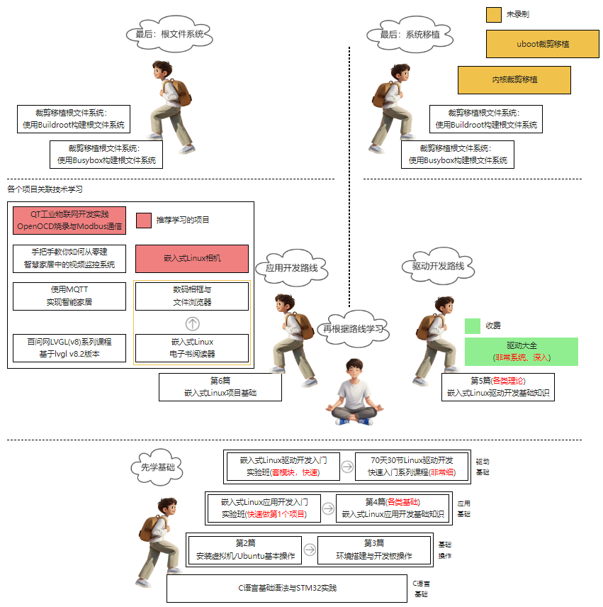
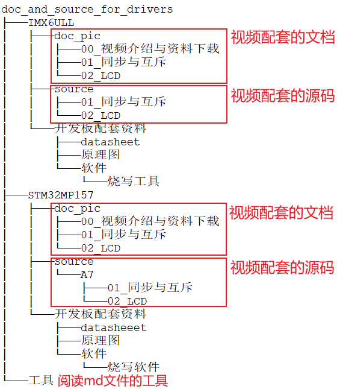
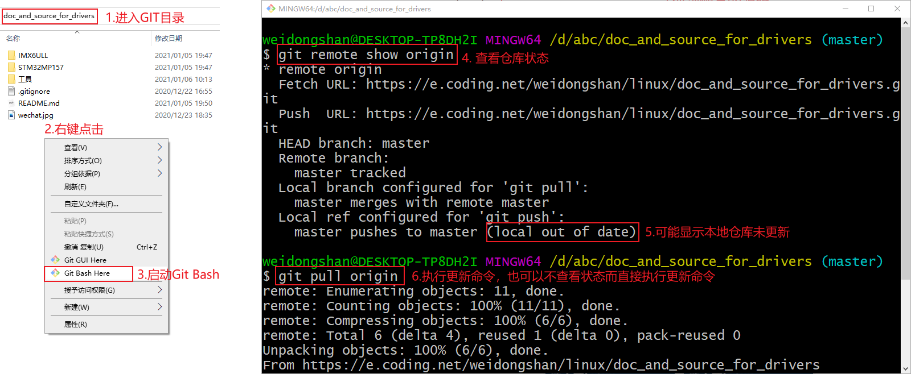
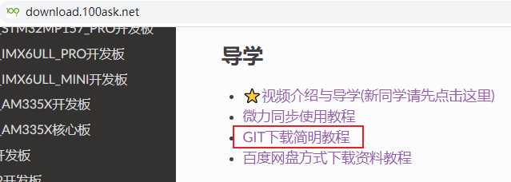
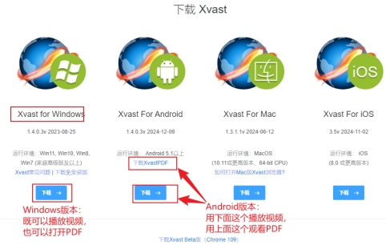
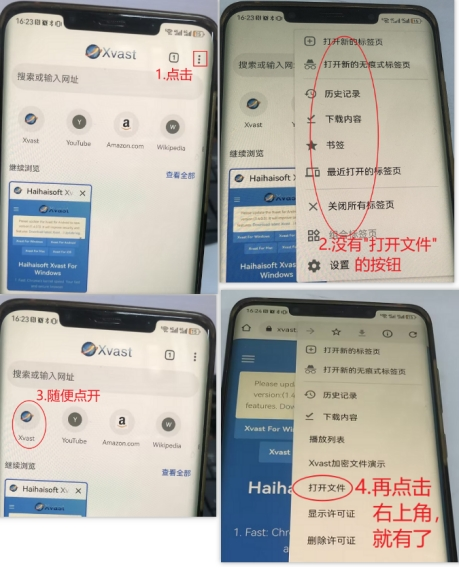

## 驱动大全视频学习与资料下载

### 1. 准备工作

先去https://gitforwindows.org/下载Windows版本的git工具。


### 2. 说在前面的话

驱动大全是比较深的课程，需要先入门Linux基础驱动后再学习。

驱动大全分为好几个专题，你可以先学习几个常用专题，比如LCD、I2C、Input、SPI。

其他专题按需学习，没必要从头到尾都学习。


### 3. 学习Linux

#### 3.1 先搭建环境、学习入门课程

学习路线：linux.100ask.net



#### 3.2 再学习驱动大全

##### 3.2.1 前先下载资料

  启动Git Bash后执行命令：

```
git clone https://e.coding.net/weidongshan/linux/doc_and_source_for_drivers.git
```

这个地址可以从下载中心看到：http://download.100ask.net
下载到的GIT仓库内容如下：



##### 3.2.2 更新GIT仓库

本教程是连载的，GIT仓库会随时更新。
你下载到GIT仓库后，最好不要修改里面的内容。
要更新GIT仓库，如下图操作即可：



上图中涉及的GIT命令为：

```shell
git remote show origin  // 查看状态
git pull origin         // 更新GIT仓库
```


GIT命令更详细的教程，可以参考：



### 4. 学习视频

驱动大全的视频放在网盘中，它是加密的视频，需要联系客服获得播放密码。

download.100ask.net左侧找到驱动大全，里面有网盘。

#### 4.1 视频播放方法

##### **4.1.1** 下载安装软件

文件名带有“_P”字样的，属于加密文件（有加密视频，也有加密的PDF）。需要使用专用浏览器打开，播放时要输入用户名和密码（购买时会提供）。

播放软件下载地址：https://www.xvast.cn/

 

 

如果Android版本出问题，可以试试：https://www.drm-x.com/download/Xvast.apk


##### **4.1.2** 打开加密文件

会提示输入用户名、密码。

对于Android版本，在左上角有“三个点”，点击它可以“打开文件”。如果没有“打开文件”的选项，可以如下操作：

 

#### 4.2 视频播放常见问题

如果提示“绑定数量不足”的问题，请联系淘宝客服进行解绑操作。

如果遇到无法登录或者异常情况可访问下载最新播放软件：https://www.xvast.cn/Xvast_Other_Version.html