# V4L2视频介绍及资料下载 #

## 1. 资料下载

GIT仓库：

```shell
https://e.coding.net/weidongshan/projects/doc_and_source_for_projects.git
```

注意：上述链接无法用浏览器打开，必须使用GIT命令来克隆。

GIT简明教程：http://download.100ask.org/tools/Software/git/how_to_use_git.html

下载到GIT仓库后，V4L2资料在里面：

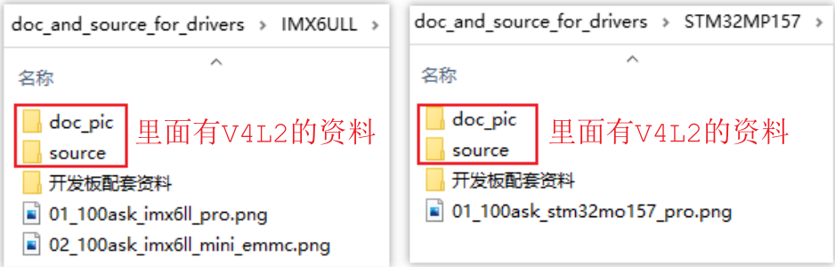


## 2. 收到的建议

ov13850在驱动中为啥要也要注册notified，同主设备注册的notified有啥区别？这块帮忙讲讲

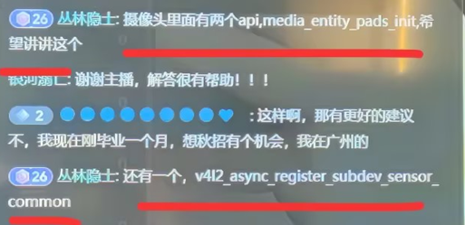

subdev, media control, media framework, vb2 buffer的分配，怎么轮转，怎么跟硬件打交道，然后图像给应用层用

有的摄像头有控制接口iic,spi，还有没有控制接口的，我们怎么处理？

串行和解串包括cphy和dphy

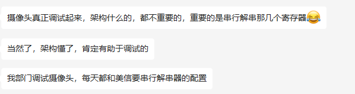


现在sensor一般都是mipi输出（iic做控制），丢到ISP，ISP处理完了就拿到一帧数据，后面还可能有裁剪和编码等。@韦东山 会有ISP部分讲解吗？最终视频输出是屏幕还是通过网络做IPC或者USB做UVC?

MIPI资料网上也挺多的啊，把协议啃一啃

https://www.mipi.org/

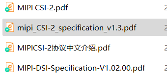

现在汽车上面都是sensor通过串行/解串器，然后通过mipi接口连接到soc

sensor---串行器---GSML---->解串器---->soc（mipi接口）这一条路也涉及一下，自动驾驶基本都涉及这个


## 3. 学习笔记

好文：https://zhuanlan.zhihu.com/p/613018868

Linux V4L2子系统分析（一）: https://blog.csdn.net/u011037593/article/details/115415136

Linux V3H 平台开发系列讲解（摄像头）2.1 MAX9296 GMSL链路配置: https://blog.csdn.net/xian18809311584/article/details/131182605


https://github.com/GStreamer/gstreamer


麦兜<chenchengwudi@sina.com> 14:55:33
我也正在看V4L2，也参考了上面提到的Linux设备驱动开发，还有内核文档，基于5.4内核的，大家可以参考下

麦兜<chenchengwudi@sina.com> 14:55:42
https://lvxfuhal9l.feishu.cn/docx/Cyssdr8BVonDnnx3YjUc4O9xngg

麦兜<chenchengwudi@sina.com> 14:55:49
https://lvxfuhal9l.feishu.cn/docx/MYYndrVvPolMA4xhBCNczE4WnWf

麦兜<chenchengwudi@sina.com> 14:56:32
准备写一组笔记，目前完成了1.5篇


颜色空间总结 https://blog.51cto.com/u_15471597/4927811

https://zhuanlan.zhihu.com/p/159148034


sRGB和RGB的转换

https://www.zhangxinxu.com/wordpress/2017/12/linear-rgb-srgb-js-convert/


YUV(有程序)

https://www.cnblogs.com/a4234613/p/15497724.html

浅谈YUV444、YUV422、YUV420

http://www.pjtime.com/2021/4/192828404475.shtml

YUV与RGB 以及之间的转换

https://blog.csdn.net/WANGYONGZIXUE/article/details/127971015

YUV 4:4:4  每一个Y对应一组UV

​    YUV 4:2:2 每两个Y共用一组UV

​    YUV 4:2:0 每四个Y共用一组UV


480i、576i是什么意思？

SDTV、EDTV、HDTV：

* SDTV：
  * 采样频率13.5MHz，
  * 每行扫描线包含858个采样点（480i系统）或864个采样点（576i系统）
  * 有效线周期内，都是720个采样点
  * 后来支持16:9宽高比，采样率为18MHz（有效分辨率为960x480i和960x576i），有效线内960个采样点
* EDTV
  * 480p、576p
  * 采样频率：4:3宽高比27MHz，16:9宽高比36MHz
* HDTV
  * 720p、1080i、1080p
  * 每线的有效采样点数量、每帧的有效线数目：都是恒定的，无论帧率如何
  * 每种帧率都使用不同的采样时钟频率

* 480i和480p系统
  * 480i属于SDTV
  * 480p属于EDTV
  * 隔行模拟分量视频
    * 每帧525线，有效扫描线为480，在23~262和286~525线上显示有效视频
    * 帧率：29.97Hz（30/1.001）
  * 隔行数字分量视频
    * 
  * 逐行模拟分量视频
    * 帧率：59.94Hz（60/1.001）
    * 每帧525线，有效扫描线为480，在45~524线上显示有效视频
* 576i和576p系统
  * 隔行模拟复合视频：单一信号线，每帧625线
  * 隔行模拟分量视频：三种信号线，帧率25Hz，每帧625线，在23~310和336~623线上显示有效视频
  * 逐行模拟分量视频：三种信号，帧率50Hz，每帧625线，在45`620线上显示有效视频
  * 隔行数字分量视频
  * 逐行数字分量视频

SDTV、EDTV、HDTV是数字电视的三种标准，分别是标清电视、增强型标清电视和高清电视。它们的区别在于分辨率、画质和声音的质量。

1. SDTV（Standard Definition Television）：标清电视，分辨率为720×576或720×480，采用4:3的屏幕比例，通常是普通的电视机或DVD播放机所使用的基本分辨率。在播放高清节目时，会有黑边或画面拉伸等显示不完整的情况。
2. EDTV（Enhanced Definition Television）：增强型标清电视，分辨率为1280×720或960×540，采用16:9的屏幕比例。比标清电视分辨率更高，但仍不达到高清的标准，适用于播放分辨率较高的电影或游戏。在播放高清节目时，会有黑边或画面拉伸等显示不完整的情况。
3. HDTV（High Definition Television）：高清电视，分辨率为1920×1080或1280×720，采用16:9的屏幕比例，画面质量高，声音也更为清晰。是当前数字电视的最高标准，适用于播放高清电影、游戏、体育赛事和其他节目。在播放标清节目时，电视会对其进行升频，会用比标清分辨率更高的分辨率去显示，从而提高画质体验。


YUV420P(YU12和YV12)格式 https://blog.csdn.net/lz0499/article/details/101029783


色彩校正中的 gamma 值是什么

https://www.jianshu.com/p/52fc2192ae7b

https://www.zhihu.com/question/27467127


https://blog.csdn.net/weixin_42203498/article/details/126753239

https://blog.csdn.net/m0_61737429/article/details/129782000

https://blog.csdn.net/seiyaaa/article/details/120199720

Linux多媒体子系统01：从用户空间使用V4L2子系统 https://blog.csdn.net/chenchengwudi/article/details/129176862

Video Demystified：

https://www.zhihu.com/column/videodemystified


摄像头：

https://mp.weixin.qq.com/s?__biz=MzUxMjEyNDgyNw==&mid=2247510675&idx=1&sn=66fcc83a95974add9d25a6e9b925c43b&chksm=f96bd867ce1c5171976838ddf995fc6f68e7e839c797bfa6f690c94b577d359939ad1a816cd1&cur_album_id=2583789151490113538&scene=189#wechat_redirect


UI 设计知识库 [01] 色彩 · 理论 https://www.jianshu.com/p/34e9660f00f4

UI 设计知识库 [02] 色彩 · 理论 – 常见问题 https://www.jianshu.com/p/7f652ae75142

UI 设计知识库 [03] 色彩 · 配色 https://www.jianshu.com/p/b56acefc66ed


sRGB https://en.wikipedia.org/wiki/SRGB https://zh.wikipedia.org/wiki/SRGB%E8%89%B2%E5%BD%A9%E7%A9%BA%E9%97%B4

色彩空间是什么？ https://www.pantonecn.com/articles/technical/what-are-your-color-spaces


Gamma、Linear、sRGB 和Unity Color Space，你真懂了吗？ https://zhuanlan.zhihu.com/p/66558476

https://baike.baidu.com/tashuo/browse/content?id=9167c87c2cd4f1c2f4d1c173&lemmaId=2147136&fromLemmaModule=pcRight


A Standard Default Color Space for the Internet - sRGB https://www.w3.org/Graphics/Color/sRGB


术语：

colorspace： SMPTE-170M、 REC-709 (CEA-861 timings) 、 sRGB (VESA DMT timings)

NTSC TV 、PAL

HDMI EDID

progressive、interlaced、

HDMI、webcam TV、S-Video

S-Video and TV inputs

Y'CbCr、RGB、

YUYV 4:4:4, 4:2:2 and 4:2:0

V4L2 capture overlay


## 4. videobuffer2

参考资料：

* https://www.linuxtv.org/downloads/v4l-dvb-apis-new/
* https://www.linuxtv.org/downloads/v4l-dvb-apis-old/vidioc-create-bufs.html
* 3种buffer：https://www.linuxtv.org/downloads/v4l-dvb-apis-old/index.html
  * https://www.linuxtv.org/downloads/v4l-dvb-apis-old/buffer.html#v4l2-memory
  * https://www.linuxtv.org/downloads/v4l-dvb-apis-old/mmap.html
  * https://www.linuxtv.org/downloads/v4l-dvb-apis-old/userp.html
  * https://www.linuxtv.org/downloads/v4l-dvb-apis-old/dmabuf.html
  * https://www.linuxtv.org/downloads/v4l-dvb-apis-old/vidioc-expbuf.html
  * 基于Streaming I/O的V4L2设备使用： https://blog.csdn.net/coroutines/article/details/70141086
* https://www.linuxtv.org/downloads/v4l-dvb-apis-old/mmap.html
* V4l2应用框架-Videobuf2数据结构 https://blog.csdn.net/weixin_42581177/article/details/126582465
* user ptr：https://github.com/h4tr3d/v4l2-capture-complex/blob/master/main.cpp


```c
static const struct vb2_ops airspy_vb2_ops = {
	.queue_setup            = airspy_queue_setup,
	.buf_queue              = airspy_buf_queue,
	.start_streaming        = airspy_start_streaming,
	.stop_streaming         = airspy_stop_streaming,
	.wait_prepare           = vb2_ops_wait_prepare,
	.wait_finish            = vb2_ops_wait_finish,
};

const struct vb2_mem_ops vb2_vmalloc_memops = {
	.alloc		= vb2_vmalloc_alloc,
	.put		= vb2_vmalloc_put,
	.get_userptr	= vb2_vmalloc_get_userptr,
	.put_userptr	= vb2_vmalloc_put_userptr,
#ifdef CONFIG_HAS_DMA
	.get_dmabuf	= vb2_vmalloc_get_dmabuf,
#endif
	.map_dmabuf	= vb2_vmalloc_map_dmabuf,
	.unmap_dmabuf	= vb2_vmalloc_unmap_dmabuf,
	.attach_dmabuf	= vb2_vmalloc_attach_dmabuf,
	.detach_dmabuf	= vb2_vmalloc_detach_dmabuf,
	.vaddr		= vb2_vmalloc_vaddr,
	.mmap		= vb2_vmalloc_mmap,
	.num_users	= vb2_vmalloc_num_users,
};


s->vb_queue.ops = &airspy_vb2_ops;          // call_qop,call_vb_qop
s->vb_queue.mem_ops = &vb2_vmalloc_memops;  // call_ptr_memop

int vb2_queue_init(struct vb2_queue *q)
		q->buf_ops = &v4l2_buf_ops;
```


### 4.1 APP request buf

```c
ioctl(fd, VIDIOC_REQBUFS, &rb);
--------------------------------
    v4l_reqbufs(const struct v4l2_ioctl_ops *ops,
		ops->vidioc_reqbufs(file, fh, p);
			vb2_ioctl_reqbufs
                res = vb2_core_reqbufs(vdev->queue, p->memory, &p->count);
                		num_buffers = min_t(unsigned int, *count, VB2_MAX_FRAME);
						num_buffers = max_t(unsigned int, num_buffers, q->min_buffers_needed);

                		// 给你机会修改num_buffers,num_planes
                		ret = call_qop(q, queue_setup, q, &num_buffers, &num_planes,		     								  plane_sizes, q->alloc_devs); // airspy_queue_setup

                        /* Finally, allocate buffers and video memory */
                        allocated_buffers =
                            __vb2_queue_alloc(q, memory, num_buffers, num_planes, plane_sizes);
             					ret = __vb2_buf_mem_alloc(vb);
                							call_ptr_memop(vb, alloc,
                                                 vb2_queue->mem_ops->alloc
                                                        vb2_vmalloc_alloc
                                                           buf->vaddr = vmalloc_user(buf->size);
                				ret = call_vb_qop(vb, buf_init, vb);
                				
```


### 4.2 queue buffer

queue buffer关键点：

* VB2的链表：list_add_tail(&vb->queued_entry, &q->queued_list);
* 驱动自己维护的链表：list_add_tail(&buf->list, &s->queued_bufs);

驱动的URB传输完成后：

* 从链表queued_bufs取出buffer
* 把URB得到的数据填入buffer
* 调用vb2_buffer_done：list_add_tail(&vb->done_entry, &q->done_list);

dequeue buffer关键点：

* 从链表done_entry取出并移除第1个vb
* 把它也从queued_list中移除

```c
ioctl(fd, VIDIOC_QBUF, &buf)
-------------------------------
    v4l_qbuf
    	ops->vidioc_qbuf(file, fh, p);
			vb2_ioctl_qbuf
                vb2_qbuf(vdev->queue, p);
					vb2_queue_or_prepare_buf(q, b, "qbuf");
					vb2_core_qbuf(q, b->index, b);
						list_add_tail(&vb->queued_entry, &q->queued_list);
						vb->state = VB2_BUF_STATE_QUEUED;

                            /*
                             * If already streaming, give the buffer to driver for processing.
                             * If not, the buffer will be given to driver on next streamon.
                             */
                            if (q->start_streaming_called)
                                __enqueue_in_driver(vb);
                                        /* sync buffers */
                                        for (plane = 0; plane < vb->num_planes; ++plane)
                                            call_void_memop(vb, prepare, vb->planes[plane].mem_priv);

                                        call_void_vb_qop(vb, buf_queue, vb);
											airspy_buf_queue
                                                list_add_tail(&buf->list, &s->queued_bufs);

                        if (pb)
                            call_void_bufop(q, fill_user_buffer, vb, pb);
					
```


### 4.3 dequeue buf

```shell
ioctl(fd, VIDIOC_DQBUF, &buf)
----------------------------------
	v4l_dqbuf
		ops->vidioc_dqbuf(file, fh, p);
			vb2_ioctl_dqbuf
				vb2_dqbuf(vdev->queue, p, file->f_flags & O_NONBLOCK);
					ret = vb2_core_dqbuf(q, NULL, b, nonblocking);
							ret = __vb2_get_done_vb(q, &vb, pb, nonblocking);
									*vb = list_first_entry(&q->done_list, struct vb2_buffer, done_entry);
									list_del(&(*vb)->done_entry);
							call_void_vb_qop(vb, buf_finish, vb);
							call_void_bufop(q, fill_user_buffer, vb, pb);
							__vb2_dqbuf(vb);

```


### 4.3 stream on

```c
ioctl(fd, VIDIOC_STREAMON, &type)
------------------------------------
    v4l_streamon
    	ops->vidioc_streamon(file, fh, *(unsigned int *)arg)
    		vb2_ioctl_streamon
    			vb2_streamon(vdev->queue, i);
					vb2_core_streamon(q, type);
						ret = vb2_start_streaming(q);
                                    /*
                                     * If any buffers were queued before streamon,
                                     * we can now pass them to driver for processing.
                                     */
                                    list_for_each_entry(vb, &q->queued_list, queued_entry)
                                        __enqueue_in_driver(vb);
                                                /* sync buffers */
                                                for (plane = 0; plane < vb->num_planes; ++plane)
                                                    call_void_memop(vb, prepare, vb->planes[plane].mem_priv);

                                                call_void_vb_qop(vb, buf_queue, vb);
													airspy_buf_queue			

                                    /* Tell the driver to start streaming */
                                    q->start_streaming_called = 1;
                                    ret = call_qop(q, start_streaming, q, atomic_read(&q->owned_by_drv_count));
												airspy_start_streaming // 分配提交URB
                                                    

```


### 4.3 stream off

```c
ioctl(fd, VIDIOC_STREAMOFF, &type)
-----------------------------------
    v4l_streamoff
    	ops->vidioc_streamoff(file, fh, *(unsigned int *)arg);
			vb2_ioctl_streamoff
                vb2_streamoff(vdev->queue, i);	
                	vb2_core_streamoff(q, type);
						__vb2_queue_cancel(q);
							call_void_qop(q, stop_streaming, q);
								airspy_stop_streaming // kill URB
                                    
							call_void_vb_qop(vb, buf_finish, vb);
```


### 4.4 阻塞与唤醒

#### 4.4.1 阻塞

```shell
memset(fds, 0, sizeof(fds));
fds[0].fd = fd;
fds[0].events = POLLIN;
if (1 == poll(fds, 1, -1))
--------------------------------------
v4l2_poll
	res = vdev->fops->poll(filp, poll);
			vb2_fop_poll
				res = vb2_poll(vdev->queue, file, wait);
							vb2_core_poll(q, file, wait);
								poll_wait(file, &q->done_wq, wait);
```

#### 4.4.2 唤醒

```shell
airspy_urb_complete
	vb2_buffer_done(&fbuf->vb.vb2_buf, VB2_BUF_STATE_DONE);
```


### 4.6 读写buf


### 4.7 vidioc_prepare_buf

```c
v4l2_ioctl_ops.vidioc_prepare_buf
    vb2_ioctl_prepare_buf
    	vb2_prepare_buf(vdev->queue, p);
			vb2_core_prepare_buf(q, b->index, b)
                call_void_bufop(q, fill_user_buffer, vb, pb);
					__fill_v4l2_buffer
                    /**
                     * __fill_v4l2_buffer() - fill in a struct v4l2_buffer with information to be
                     * returned to userspace
                     */
                        
```


## 5. ISP源码分析

参考源码： https://gitee.com/juping_zheng1/v85x-mediactrlvideo_set_isp_bk_buffer_ali

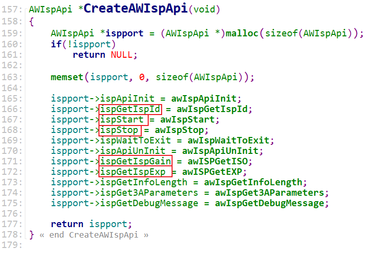

上图里，只有红框里的函数被调用。

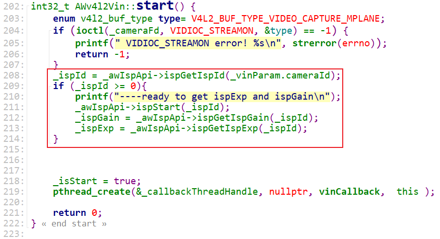

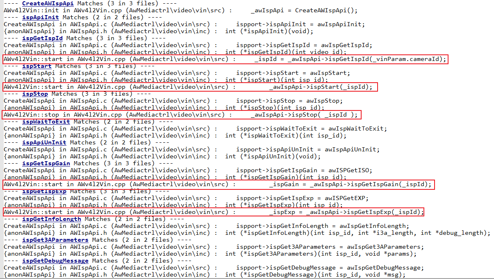


## 6. media分析

参考资料：

* linux v4l2架构分析——media_device的注册过程分析 https://blog.csdn.net/ismycsdn/article/details/129202760
* https://www.linuxtv.org/downloads/v4l-dvb-apis-new/pdf/media.pdf


## 7. subdev

使用：https://blog.csdn.net/qq_34341546/article/details/131129174

subdev分析比较全面的文章：https://blog.csdn.net/u011037593/article/details/115415136

linux media子系统分析之media控制器设备：https://zhuanlan.zhihu.com/p/638020445

内核文档：Linux-4.9.88\Documentation\zh_CN\video4linux\v4l2-framework.txt

Linux V4L2子系统分析（一）: https://blog.csdn.net/u011037593/article/details/115415136


主设备可通过v4l2_subdev_call的宏调用从设备提供的方法


代码分析参考：

```shell
https://www.cnblogs.com/rongpmcu/p/7662738.html
https://www.cnblogs.com/rongpmcu/p/7662741.html
https://www.cnblogs.com/rongpmcu/p/7662745.html
```

我的分析：

```c
platform_device: Linux-4.9.88\arch\arm\mach-imx\mach-mx31_3ds.c
platform_driver: Linux-4.9.88\drivers\media\platform\soc_camera\soc_camera.c
sensor driver:   Linux-4.9.88\drivers\media\i2c\soc_camera\ov2640.c
```


## 8. media

linux media子系统分析之media控制器设备：https://zhuanlan.zhihu.com/p/638020445

https://www.kernel.org/doc/html/latest/driver-api/media/mc-core.html

https://www.kernel.org/doc/html/latest/userspace-api/media/index.html

【linux kernel】linux media子系统分析之media控制器设备: https://blog.csdn.net/iriczhao/article/details/131276897

https://docs.kernel.org/driver-api/media/mc-core.html#c.media_device


Linux MIPI 摄像头驱动框架编写（RN6752解码芯片）: https://www.cnblogs.com/jzcn/p/17823309.html

Linux Media 子系统链路分析: https://www.cnblogs.com/jzcn/p/17822224.html

media-ctl调试：生成拓扑和数据流图: https://blog.csdn.net/qq_34341546/article/details/129119359


MIPI扫盲——D-PHY介绍（一）: https://zhuanlan.zhihu.com/p/638769112?utm_id=0


[Linux 基础] -- Linux media 子系统:  https://blog.csdn.net/u014674293/article/details/111318314


Camera | 3.瑞芯微平台MIPI摄像头常用调试命令 https://zhuanlan.zhihu.com/p/604324755?utm_id=0


生成文档：

```shell
sudo apt-get install python3-sphinx
cd linux_kernel
make htmldocs
makd pdfdocs

生成的文档放在 Documentation/output 文件夹中
```


### 8.1 基本概念

参考文档《doc_and_source_for_drivers\IMX6ULL\doc_pic\13_V4L2\media.pdf》之《2.5 Media Controller devices  》

```shell
struct media_device， media_device_register， media_device_unregister

struct media_entity, The structure is usually embedded into a higher-level structure, such as
v4l2_subdev or video_device instances. Drivers initialize entity pads by calling media_entity_pads_init(). Drivers register entities with a media device by calling media_device_register_entity() and unregistered by calling media_device_unregister_entity().

Interfaces似乎没什么用，给 media_create_intf_link 使用？
以后要分析media_ctl打印link的全过程，Interfaces是终点吗？
Interfaces are represented by a struct media_interface instance, defined in include/media/
media-entity.h. Currently, only one type of interface is defined: a device node. Such interfaces are represented by a struct media_intf_devnode.
Drivers initialize and create device node interfaces by calling media_devnode_create() and
remove them by calling: media_devnode_remove().

Pads are represented by a struct media_pad instance, defined in include/media/
media-entity.h. Each entity stores its pads in a pads array managed by the entity driver.
Drivers usually embed the array in a driver-specific structure.
Pads are identified by their entity and their 0-based index in the pads array.
Both information are stored in the struct media_pad, making the struct media_pad pointer
the canonical way to store and pass link references.
Pads have flags that describe the pad capabilities and state.
MEDIA_PAD_FL_SINK indicates that the pad supports sinking data. MEDIA_PAD_FL_SOURCE indicates that the pad supports sourcing data.

Links are represented by a struct media_link instance, defined in include/media/
media-entity.h. There are two types of links:
1. pad to pad links
Drivers create pad to pad links by calling: media_create_pad_link() and remove with
media_entity_remove_links().
2. interface to entity links
Drivers create interface to entity links by calling: media_create_intf_link() and remove with
media_remove_intf_links().
video_register_device > 
    __video_register_device > 
        video_register_media_controller > 
            media_create_intf_link
```


### 8.2 Graph traversal  

获得所有的entity：

```shell
media_device_for_each_entity(entity, mdev) 
```


遍历：

```shell
Drivers might also need to iterate over all entities in a graph that can be reached only through
enabled links starting at a given entity. The media framework provides a depth-first graph
traversal API for that purpose.

Drivers initiate a graph traversal by calling media_graph_walk_start()
The graph structure, provided by the caller, is initialized to start graph traversal at the given entity.
Drivers can then retrieve the next entity by calling media_graph_walk_next()
When the graph traversal is complete the function will return NULL.

Helper functions can be used to find a link between two given pads, or a pad
connected to another pad through an enabled link media_entity_find_link() and
media_entity_remote_pad().

linux 4.9
void media_entity_graph_walk_start(struct media_entity_graph *graph,
				   struct media_entity *entity)
linux 5.4
void media_graph_walk_start(struct media_graph *graph,
			    struct media_entity *entity)

Link properties can be modified at runtime by calling media_entity_setup_link()

When starting streaming, drivers must notify all entities in the pipeline to prevent link states
from being modified during streaming by calling media_pipeline_start().
Link configuration will fail with -EBUSY by default if either end of the link is a streaming entity.Links that can be modified while streaming must be marked with the MEDIA_LNK_FL_DYNAMIC
flag.

media_device_init initializes the media device prior to its registration. The media device initialization
and registration is split in two functions to avoid race conditions and make the media device
available to user-space before the media graph has been completed.
So drivers need to first initialize the media device, register any entity within the media device, create pad to pad links and then finally register the media device by calling
media_device_register() as a final step.

```


## 9. v853上编译v4l2-utils

http://linuxtv.org/downloads/v4l-utils

```shell
#export PATH=$PATH:/home/book/tina-v853-open/prebuilt/rootfsbuilt/arm/toolchain-sunxi-musl-gcc-830/toolchain/bin

export PATH=$PATH:/home/book/tina-v853-open/prebuilt/rootfsbuilt/arm/toolchain-sunxi-glibc-gcc-830/toolchain/bin

#export STAGING_DIR=/home/book/tina-v853-open/prebuilt/rootfsbuilt/arm/toolchain-sunxi-musl-gcc-830/toolchain/arm-openwrt-linux-muslgnueabi

sudo apt install autopoint

cd ~/v4l-utils-1.20.0
#./configure --host=arm-openwrt-linux --prefix=$PWD/tmp --with-udevdir=$PWD/tmp
./configure --host=arm-openwrt-linux-gnueabi --prefix=$PWD/tmp --with-udevdir=$PWD/tmp LDFLAGS="-static"
rm media-ctl
make V=1 # 有错也没关系

# 使用静态链接制作media-ctl
cd utils/media-ctl/
arm-openwrt-linux-gcc -g -O2 -o media-ctl media-ctl.o options.o  ./.libs/libmediactl.a ./.libs/libv4l2subdev.a -static

make install

sudo apt install adb

adb push media-ctl /root

# 先运行camerademo
camerademo
# 否则下面的命令会崩溃
media-ctl -p -d /dev/media0

media-ctl -d /dev/media0 --print-dot > media0.dot
```


Ubuntu上：

```shell
sudo apt install  xdot

dot -Tpng media0.dot -o media0.png
```


Ubuntu上测试USB摄像头：

```shell
cd ~/v4l-utils-1.20.0
./configure
make
sudo make install

su root
media-ctl -p -d /dev/media0
media-ctl -d /dev/media0 --print-dot > uvc_media0.dot
dot -Tpng uvc_media0.dot -o uvc_media0.png
```


## 10. v853驱动分析

vin.c里注册了一系列的platform_driver：

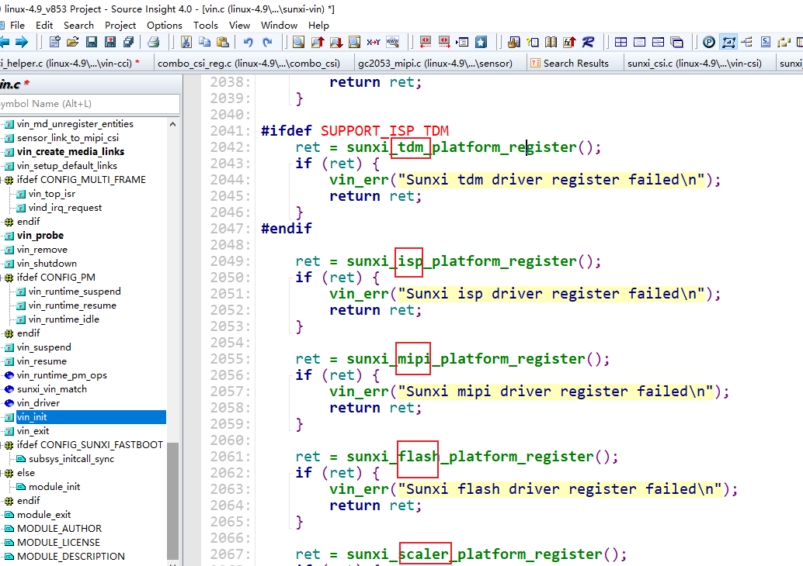


这些驱动，对应下图各个entity：


### 10.1 sensor

drivers\media\platform\sunxi-vin\modules\sensor\sensor_helper.c：

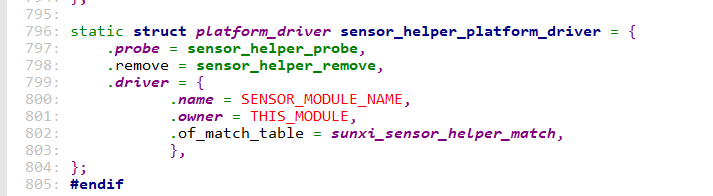


vin.c分析：

```shell
vin_probe
	vin_md_register_entities(vind, dev->of_node);
		__vin_register_module(vind, module, j)
			__vin_subdev_register
				sd = v4l2_i2c_new_subdev(v4l2_dev, adapter, name, addr, NULL);
					v4l2_i2c_new_subdev_board
						client = i2c_new_device(adapter, info); // 导致gc2053_mipi.c的probe被调用
						
						// i2c_new_device里调用sensor_probe,生成了subdev
						sd = i2c_get_clientdata(client);
						v4l2_device_register_subdev(v4l2_dev, sd)
						

// gc2053_mipi.c的probe被调用
sensor_probe
	info = kzalloc(sizeof(struct sensor_info), GFP_KERNEL);
	sd = &info->sd;
		cci_dev_probe_helper(sd, client, &sensor_ops, &cci_drv[i]);
			v4l2_i2c_subdev_init(sd, client, sensor_ops);
				i2c_set_clientdata(client, sd);
			cci_media_entity_init_helper(sd, cci_drv);
				si->sensor_pads[SENSOR_PAD_SOURCE].flags = MEDIA_PAD_FL_SOURCE;
				sd->entity.function = MEDIA_ENT_F_CAM_SENSOR;
				return media_entity_pads_init(&sd->entity, SENSOR_PAD_NUM, si->sensor_pads);
            	
```

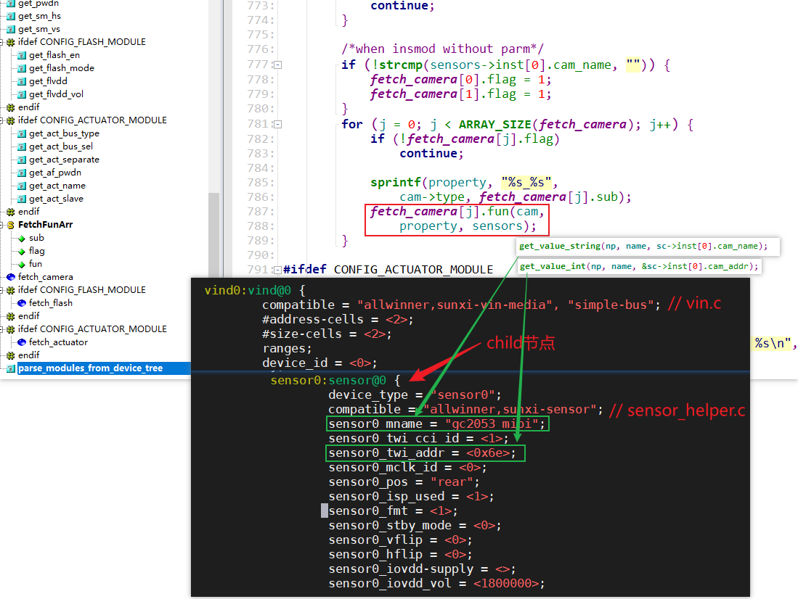


### 10.2 sunxi_mipi

drivers/media/platform/sunxi-vin/vin-mipi/sunxi_mipi.c

```c
static struct platform_driver mipi_platform_driver = {
	.probe = mipi_probe,
	.remove = mipi_remove,
	.driver = {
		.name = MIPI_MODULE_NAME,
		.owner = THIS_MODULE,
		.of_match_table = sunxi_mipi_match,
	}
};
```

设备树：

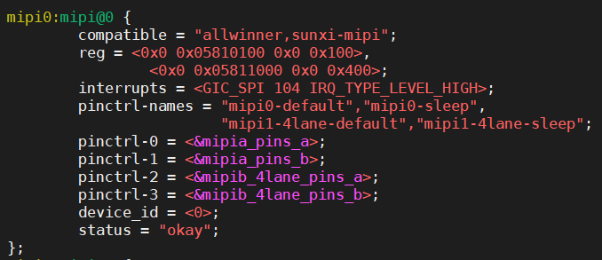

```shell
mipi_probe
	ret = __mipi_init_subdev(mipi);
		v4l2_subdev_init(sd, &sunxi_mipi_subdev_ops);

        /*sd->entity->ops = &isp_media_ops;*/
        mipi->mipi_pads[MIPI_PAD_SINK].flags = MEDIA_PAD_FL_SINK;
        mipi->mipi_pads[MIPI_PAD_SOURCE].flags = MEDIA_PAD_FL_SOURCE;
        sd->entity.function = MEDIA_ENT_F_IO_V4L;

        ret = media_entity_pads_init(&sd->entity, MIPI_PAD_NUM, mipi->mipi_pads);
```

上面并没有注册mipi的subdev，在vin.c里：

```c
	for (i = 0; i < VIN_MAX_MIPI; i++) {
		/*Register MIPI subdev */
		vind->mipi[i].id = i;
		vind->mipi[i].sd = sunxi_mipi_get_subdev(i);
		ret = v4l2_device_register_subdev(&vind->v4l2_dev,
							vind->mipi[i].sd);
		if (ret < 0)
			vin_log(VIN_LOG_MD, "mipi%d register fail!\n", i);
	}
```


### 10.3 sunxi_csi

drivers\media\platform\sunxi-vin\vin-csi\sunxi_csi.c

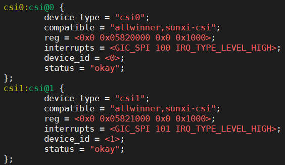

```shell
csi_probe
	__csi_init_subdev(csi);
		v4l2_subdev_init(sd, &sunxi_csi_subdev_ops);

        csi->csi_pads[CSI_PAD_SINK].flags = MEDIA_PAD_FL_SINK;
        csi->csi_pads[CSI_PAD_SOURCE].flags = MEDIA_PAD_FL_SOURCE;
        sd->entity.function = MEDIA_ENT_F_IO_V4L;

        ret = media_entity_pads_init(&sd->entity, CSI_PAD_NUM, csi->csi_pads);

	glb_parser[csi->id] = csi;	
```

上面并没有注册mipi的subdev，在vin.c里：

```c
	for (i = 0; i < VIN_MAX_CSI; i++) {
		/*Register CSI subdev */
		vind->csi[i].id = i;
		vind->csi[i].sd = sunxi_csi_get_subdev(i);
		ret = v4l2_device_register_subdev(&vind->v4l2_dev,
							vind->csi[i].sd);
		if (ret < 0)
			vin_log(VIN_LOG_MD, "csi%d register fail!\n", i);
	}
```


### 10.4 tdm

drivers\media\platform\sunxi-vin\vin-tdm\vin_tdm.c

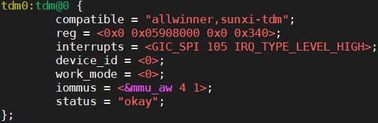

```shell
tdm_probe
	ret = __tdm_init_subdev(&tdm->tdm_rx[i]);
        v4l2_subdev_init(sd, &sunxi_tdm_subdev_ops);
        sd->grp_id = VIN_GRP_ID_TDM_RX;
        sd->flags |= V4L2_SUBDEV_FL_HAS_DEVNODE;
        snprintf(sd->name, sizeof(sd->name), "sunxi_tdm_rx.%u", tdm_rx->id);
        v4l2_set_subdevdata(sd, tdm_rx);

        tdm_rx->tdm_pads[TDM_PAD_SINK].flags = MEDIA_PAD_FL_SINK;
        tdm_rx->tdm_pads[TDM_PAD_SOURCE].flags = MEDIA_PAD_FL_SOURCE;
        sd->entity.function = MEDIA_ENT_F_IO_V4L;

        ret = media_entity_pads_init(&sd->entity, TDM_PAD_NUM, tdm_rx->tdm_pads);		
	glb_tdm[tdm->id] = tdm;
```

上面并没有注册mipi的subdev，在vin.c里：

```c
	for (i = 0; i < VIN_MAX_TDM; i++) {
		/*Register TDM subdev */
		vind->tdm[i].id = i;
		for (j = 0; j < TDM_RX_NUM; j++) {
			vind->tdm[i].tdm_rx[j].sd = sunxi_tdm_get_subdev(i, j);
			ret = v4l2_device_register_subdev(&vind->v4l2_dev,
							vind->tdm[i].tdm_rx[j].sd);
			if (ret < 0)
				vin_log(VIN_LOG_MD, "the tdx%d of tdx_rx%d register fail!\n", i, j);
		}
	}

```


### 10.5 sunxi_isp

drivers/media/platform/sunxi-vin/vin-isp/sunxi_isp.c

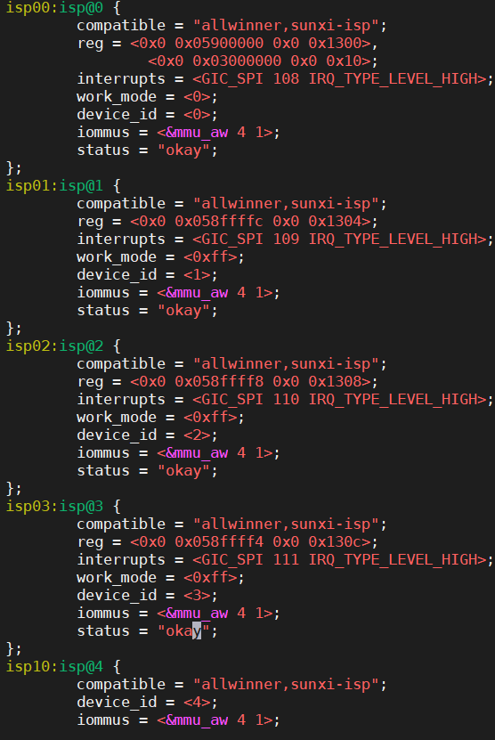

```shell
isp_probe
	vin_isp_h3a_init
        v4l2_subdev_init(&stat->sd, &h3a_subdev_ops);
        snprintf(stat->sd.name, V4L2_SUBDEV_NAME_SIZE, "sunxi_h3a.%u", isp->id);
        stat->sd.grp_id = VIN_GRP_ID_STAT;
        stat->sd.flags |= V4L2_SUBDEV_FL_HAS_EVENTS | V4L2_SUBDEV_FL_HAS_DEVNODE;
        v4l2_set_subdevdata(&stat->sd, stat);

        stat->pad.flags = MEDIA_PAD_FL_SINK;
        stat->sd.entity.function = MEDIA_ENT_F_PROC_VIDEO_STATISTICS;

        return media_entity_pads_init(&stat->sd.entity, 1, &stat->pad);
	
	glb_isp[isp->id] = isp;
```

上面并没有注册mipi的subdev，在vin.c里：

```c
	for (i = 0; i < VIN_MAX_ISP; i++) {
		/*Register ISP subdev */
		vind->isp[i].id = i;
		vind->isp[i].sd = sunxi_isp_get_subdev(i);
		ret = v4l2_device_register_subdev(&vind->v4l2_dev,
							vind->isp[i].sd);
		if (ret < 0)
			vin_log(VIN_LOG_MD, "isp%d register fail!\n", i);
#if !defined CONFIG_ISP_SERVER_MELIS
		/*Register STATISTIC BUF subdev */
		vind->stat[i].id = i;
		vind->stat[i].sd = sunxi_stat_get_subdev(i);
		ret = v4l2_device_register_subdev(&vind->v4l2_dev,
							vind->stat[i].sd);
		if (ret < 0)
			vin_log(VIN_LOG_MD, "stat%d register fail!\n", i);
#endif
	}
```

### 10.6 sunxi_scaler

drivers\media\platform\sunxi-vin\vin-vipp\sunxi_scaler.c

```c
static const struct of_device_id sunxi_scaler_match[] = {
	{.compatible = "allwinner,sunxi-scaler",},
	{},
};

static struct platform_driver scaler_platform_driver = {
	.probe    = scaler_probe,
	.remove   = scaler_remove,
	.driver = {
		.name   = SCALER_MODULE_NAME,
		.owner  = THIS_MODULE,
		.of_match_table = sunxi_scaler_match,
	},
};
```

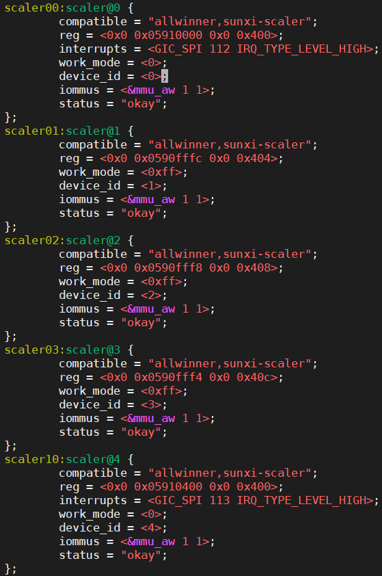

```shell
scaler_probe
    __scaler_init_subdev(scaler);
        v4l2_subdev_init(sd, &sunxi_scaler_subdev_ops);
        sd->grp_id = VIN_GRP_ID_SCALER;
        sd->flags |= V4L2_SUBDEV_FL_HAS_EVENTS | V4L2_SUBDEV_FL_HAS_DEVNODE;
        snprintf(sd->name, sizeof(sd->name), "sunxi_scaler.%u", scaler->id);
        v4l2_set_subdevdata(sd, scaler);

        /*sd->entity->ops = &isp_media_ops;*/
        scaler->scaler_pads[SCALER_PAD_SINK].flags = MEDIA_PAD_FL_SINK;
        scaler->scaler_pads[SCALER_PAD_SOURCE].flags = MEDIA_PAD_FL_SOURCE;
        sd->entity.function = MEDIA_ENT_F_PROC_VIDEO_SCALER;

        ret = media_entity_pads_init(&sd->entity, SCALER_PAD_NUM,
                scaler->scaler_pads);
   		platform_set_drvdata(pdev, scaler);
    glb_vipp[scaler->id] = scaler;

```

上面并没有注册mipi的subdev，在vin.c里：

```c
	for (i = 0; i < VIN_MAX_SCALER; i++) {
		/*Register SCALER subdev */
		vind->scaler[i].id = i;
		vind->scaler[i].sd = sunxi_scaler_get_subdev(i);
		ret = v4l2_device_register_subdev(&vind->v4l2_dev,
							vind->scaler[i].sd);
		if (ret < 0)
			vin_log(VIN_LOG_MD, "scaler%d register fail!\n", i);
	}
```


### 10.7 vin_cap

drivers\media\platform\sunxi-vin\vin-video\vin_core.c

```c
static const struct of_device_id sunxi_vin_core_match[] = {
	{.compatible = "allwinner,sunxi-vin-core",},
	{},
};

static struct platform_driver vin_core_driver = {
	.probe = vin_core_probe,
	.remove = vin_core_remove,
	.shutdown = vin_core_shutdown,
	.driver = {
		   .name = VIN_CORE_NAME,
		   .owner = THIS_MODULE,
		   .of_match_table = sunxi_vin_core_match,
		   .pm = &vin_core_runtime_pm_ops,
		   },
};
```

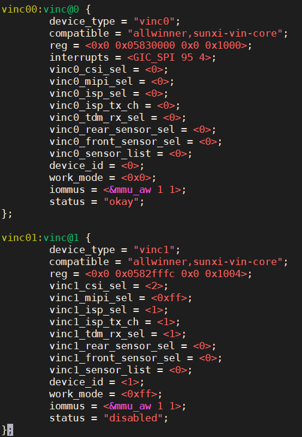

```shell
vin_core_probe
	ret = vin_initialize_capture_subdev(vinc);
		struct v4l2_subdev *sd = &vinc->vid_cap.subdev;
		
        v4l2_subdev_init(sd, &vin_subdev_ops);
        sd->grp_id = VIN_GRP_ID_CAPTURE;
        sd->flags |= V4L2_SUBDEV_FL_HAS_DEVNODE;
        snprintf(sd->name, sizeof(sd->name), "vin_cap.%d", vinc->id);

        vinc->vid_cap.sd_pads[VIN_SD_PAD_SINK].flags = MEDIA_PAD_FL_SINK;
        vinc->vid_cap.sd_pads[VIN_SD_PAD_SOURCE].flags = MEDIA_PAD_FL_SOURCE;
        sd->entity.function = MEDIA_ENT_F_IO_V4L;
        ret = media_entity_pads_init(&sd->entity, VIN_SD_PADS_NUM,
                    vinc->vid_cap.sd_pads);
        if (ret)
            return ret;

        sd->entity.ops = &vin_sd_media_ops;
        sd->internal_ops = &vin_capture_sd_internal_ops;
        v4l2_set_subdevdata(sd, vinc);
		
```

上面并没有注册mipi的subdev，在vin.c里：

```c
vin_md_register_core_entity
	sd = &vinc->vid_cap.subdev;
	v4l2_set_subdev_hostdata(sd, (void *)&vin_pipe_ops);

	ret = v4l2_device_register_subdev(&vind->v4l2_dev, sd);
```


设备树里vinc@0,4,8,12的status都是okay，但是vinc@4,8里：

```shell
vinc4_rear_sensor_sel = <1>;
vinc8_rear_sensor_sel = <1>;
```

并没有sensor 1，所以没有创建出对应的subdev，没有创建出对应的/dev/video4,8


### 10.8 vin_video0

drivers/media/platform/sunxi-vin/vin-video/vin_video.c

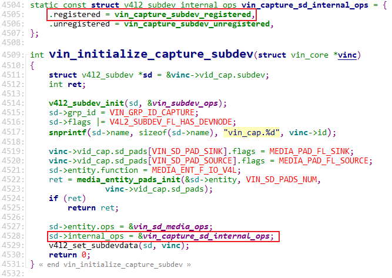

```shell
vin_init_video
        snprintf(cap->vdev.name, sizeof(cap->vdev.name),
            "vin_video%d", cap->vinc->id);
        cap->vdev.fops = &vin_fops;
        cap->vdev.ioctl_ops = &vin_ioctl_ops;
        cap->vdev.release = video_device_release_empty;
        cap->vdev.ctrl_handler = &cap->ctrl_handler;
        cap->vdev.v4l2_dev = v4l2_dev;
        cap->vdev.queue = &cap->vb_vidq;
        cap->vdev.lock = &cap->lock;
        cap->vdev.flags = V4L2_FL_USES_V4L2_FH;
        ret = video_register_device(&cap->vdev, VFL_TYPE_GRABBER, cap->vinc->id);

        cap->vd_pad.flags = MEDIA_PAD_FL_SINK;
        ret = media_entity_pads_init(&cap->vdev.entity, 1, &cap->vd_pad);
```


### 10.100 疑问

subdev的v4l2_subdev_ops函数何时被调用？

sd->internal_ops何时被调用？


## 11. 调用过程分析

### 11.1 link


## 12. 其他

v4l2-event：自定义事件调试 https://blog.csdn.net/qq_34341546/article/details/131329503


## 13. 编译v853 video app

### 13.1 不使用ISP的APP

解压后，源码为：sample_ex_compile/sample/sample_driverVipp/sample_driverVipp.c

```shell
tar xzf 100ASK-driverVIPP.tar.gz
cd sample_ex_compile

export STAGING_DIR=$PWD/toolchain/toolchain-sunxi-glibc/toolchain/arm-openwrt-linux-gnueabi
```

最后生成：

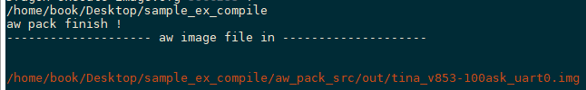


烧写：先使用如下工具打开上图的映像文件，然后按住板子的FEL键，再按下、松开reset，即可自动烧写：

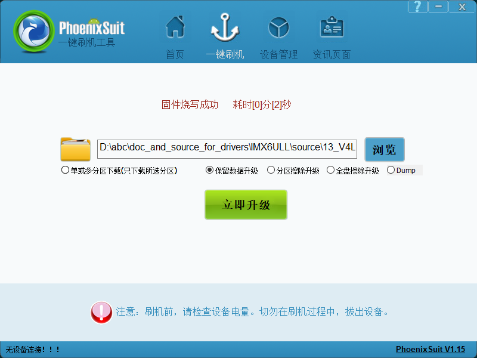


运行：

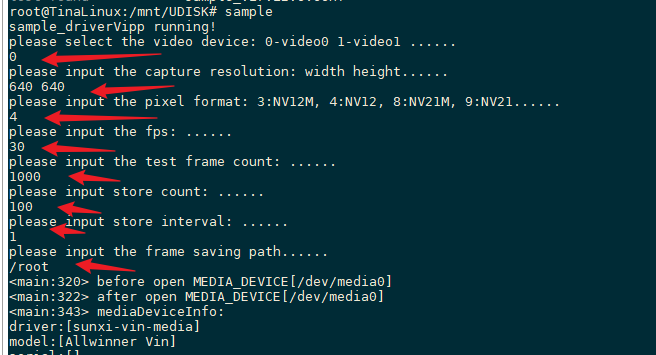

生成的的文件，可以使用YUVPlayer.exe显示（需要设置尺寸为640x640)：

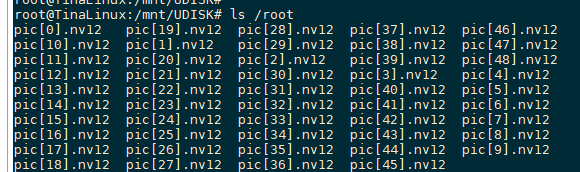

### 13.2 使用ISP的APP

100ask_vivo_glibc_example.tar.gz解压后得到openwrt目录，先烧写13.1的映像文件，然后使用如下命令上传bin文件：

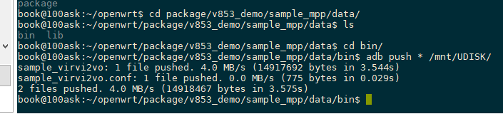

在板子上执行：

```shell
dd if=/dev/zero of=/dev/fb0   # 去掉中间logo

cd /mnt/UDISK
./sample_virvi2vo -path sample_virvi2vo.conf  # 可以在屏幕上看到摄像头图像
```


源码：

https://forums.100ask.net/t/topic/2986

https://forums.100ask.net/t/topic/3107

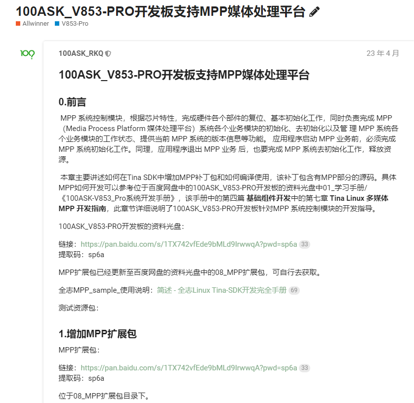

### 13.3 尝试把使用ISP的APP打包进映像文件(不成功)

```shell
tar xzf 100ask_vivo_glibc_example.tar.gz
cp -rf openwrt/ tina-v853-open
cd tina-v853-open/

source build/envsetup.sh

make distclean

lunch  // 1  v853-100ask-tina
make menuconfig

```

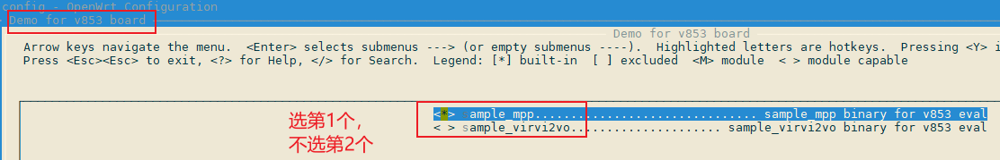


```shell
make -j 32
```

烧写系统


运行：

```shell
sample_virvi2vo -path sample_virvi2vo.conf
```


### 13.4 sample_virvi2vo分析

配置文件：

```shell
# cat sample_virvi2vo.conf
########### paramter (ref to tulip_cedarx.conf)############
[parameter]
capture_width = 360
capture_height = 640
display_x = 0
display_y = 0
display_width = 480
display_height = 800
layer_num = 0
isp_dev = 0
vipp_dev = 0

capture_width2 = 0
capture_height2 = 640
display_x2 = 0
display_y2 = 0
display_width2 = 0
display_height2 = 640
layer_num2 = 4
isp_dev2 = 0
vipp_dev2 = 4

capture_width3 = 0
capture_height3 = 360
display_x3 = 240
display_y3 = 320
display_width3 = 0
display_height3 = 320
layer_num3 = 5
isp_dev3 = 0
vipp_dev3 = 0

add_ui_layer = 0
ui_test_layer = 9
ui_display_width = 480
ui_display_height = 640

# disp_type is lcd, hdmi, cvbs
disp_type = "lcd"

# pic_format is yu12, yv12, nv21, nv12, nv21s
pic_format = nv21
frame_rate = 20
test_duration = 0       #unit:s
```


初始化过程：

```shell
CreateVIPP2VOLink
    AW_MPI_VI_CreateVipp
        videoInputHw_Construct
        videoInputHw_ChnInit > 
            isp_video_open
                ret = video_init(video); // 根据vin_video0打开/dev/video0

                // media_entity_remote_source, 找到 sunxi_isp
                video->isp_id = media_video_to_isp_id(video->entity); 
	AW_MPI_VI_GetVippAttr
		videoInputHw_GetChnAttr
			video_get_fmt(video, &vfmt);
	AW_MPI_VI_SetVippAttr
    	videoInputHw_SetChnAttr	
```

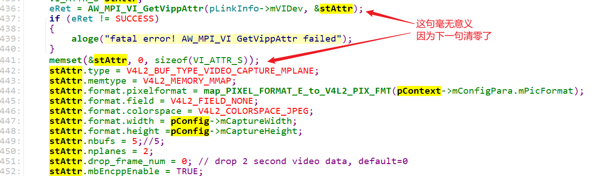


log:

```shell
# ./sample_virvi2vo -path sample_virvi2vo.conf
I0101 18:42:55.387466  1244 sample_virvi2vo.c:1042]         <main> sample_virvi2vo running!
I0101 18:42:55.388311  1244 sample_virvi2vo.c:108]          <ParseCmdLine> sample_virvi2vo path:[./sample_virvi2vo], arg number is [3]
I0101 18:42:55.389066  1244 confparser.c:60]                <createConfParser> load conf file sample_virvi2vo.conf ok!
I0101 18:42:55.389293  1244 sample_virvi2vo.c:309]          <loadSampleVIRVI2VOConfig> vipp[0]: captureSize[360x640], displayArea[0,0,480x800]
I0101 18:42:55.389377  1244 sample_virvi2vo.c:309]          <loadSampleVIRVI2VOConfig> vipp[4]: captureSize[0x640], displayArea[0,0,0x640]
I0101 18:42:55.389435  1244 sample_virvi2vo.c:311]          <loadSampleVIRVI2VOConfig> dispSync[1], dispType[64], frameRate[20], testDuration[0]
I0101 18:42:55.389589  1244 mpi_sys.c:842]                  <AW_MPI_SYS_SetConf> kfctmpdir is [/tmp]
>>>>>>>>>>>>>>>>>>>>>>>>>>>>> Media Process Platform<<<<<<<<<<<<<<<<<<<<<<<<<<<<
modName : MPP-Platform
tag   : V1.0 Release
branch: v5-dev
commit: 4eed413532ad87725895a8cb1ba75e22fc328233
date  : 20170725
author: jenkins
I0101 18:42:55.397494  1244 mpi_sys.c:1455]                 <AW_MPI_SYS_Init> ISP init
[ISP]>>>>>>>>>>>>>>>>>>>> ISP VERSION INFO <<<<<<<<<<<<<<<<<<<
IPCORE: ISP600
branch: libisp-dev
commit: c3bfa4e23fb037123e65a04eaaa39f7876cfe1a6
date  : Mon Apr 10 10:37:15 2023 +0800
author: <zhenghanjie@allwinnertech.com>
--------------------------------------------------------

I0101 18:42:55.398060  1244 mpi_sys.c:1457]                 <AW_MPI_SYS_Init> ISP init done
I0101 18:42:55.404819  1244 hwdisplay.c:84]                 <hw_display_init>
I0101 18:42:55.404994  1244 hwdisplay.c:993]                <hwd_init> (hwd_init 993)
I0101 18:42:55.405184  1244 hwdisplay.c:1048]               <hwd_init> ret[0][2,0]ch[0]lyl[0] init: enable[0], screenwin[0,0, 0x0], zorder[0], alpha[mode:0, value:0]
I0101[ 2205.839429] [VIN]ve_online close
 18:42:55.491717  1244 audio_hw.c:228]                      <MakeAllMixerElemsAvailable> pcm open and close, all MixerElems maybe exist.
I0101 18:42:55.491901  1244 alsa_interface.c:707]           <alsaOpenMixer> open mixer:hw:0
I0101 18:42:55.493348  1244 alsa_interface.c:762]           <alsaOpenMixer> set playback vol_val to value: 27
I0101 18:42:55.493959  1244 hwdisplay.c:1248]               <hwd_get_disp_type> Current the  disp_type:0x1  tv_mode:0x0
I0101 18:42:55.494469  1246 mpi_[ 2205.884400] [VIN_WARN]width is towards 16 alignment
sys.c:1073]                                                 <MonitorEnvVarThread> detect user environment:
I0101 18:42:55.494703  1246 mpi_sys.c:1074]                 <MonitorEnvVarThread> /tmp/mpp_log_level
I0101 18:42:55.494794  1246 mpi_sys.c:1075]                 <MonitorEnvVarThread> /tmp/mpp_venc_sei_config_param
I0101 18:42:55.514280  1244 sample_virvi2vo.c:419]          <CreateVIPP2VOLink> Vipp dev[0] vir_chn[0]
[ISP]video device name is vin_video0
[ISP]open video device[0], detect isp0 success!
[ISP]video_set_isp_bk_buffer_align yuv_align_en = 1, lbc_align_en = 0
I0101 18:42:55.514947  1244 videoInputHw.c:956]             <videoInputHw_SetChnAttr> vipp[0] yuv format, width 360 is not 16 aligned, set bk width stride en 1
[ISP]video_set_isp_bk_width_stride stride_en = 1
[ISP]video0 fd[9] ve_online_en=0, dma_buf_num=0
[ISP]open isp device[0] success!
[ISP]get isp_ctx from /mnt/extsd/isp0_1920_1088_20_0_ctx_saved.bin success!!!
[ISP]prefer isp config: [gc2053_mipi], 1920x1088, 20, 0, 0
[ISP]find gc2053_mipi_1920_1088_20_0 [gc2053_mipi_isp600_20220511_164617_vlc4_day] isp config
[ISP]isp version is isp600-100
[ISP]read restrict key_buf is 0x0
[ISP]create isp0 server thread!
I0101 18:42:55.595491  1244 mpi_vi.c:1209]                  <AW_MPI_VI_CreateVirChn> we allow to create virChn[0] in disable status of vipp[0]
I0101 18:42:55.595910  1244 videoInputHw.c:1197]            <videoInputHw_ChnEnable> isp[0] sensor info width:1920, height:1088; user set width:360, height:640
I0101 18:42:55.639629  1249 videoInputHw.c:5637]            <VideoInputHw_CapThread> loop VideoInputHw_CapThread vipp_id = 0, buf_num=5.
I0101 18:42:55.639773  1244 hwdisplay.c:1121]               <hwd_layer_request_hlay> hlay:0, zorder=0, cnt:2
I0101 18:42:55.640006  1244 mpi_vo.c:1038]                  <AW_MPI_VO_SetVideoLayerAttr> ch[0]lyl[0]:dispRect changed, [0, 0, 320x240]->[0, 0, 480x800]
I0101 18:42:55.640098  1244 hwdisplay.c:409]                <hwd_layer_set_rect> ch[0]lyl[0]: screen_win[0,0, 480x800]
I0101 18:42:55.640596  1244 sample_virvi2vo.c:536]          <CreateVIPP2VOLink> create vo channel[0] success!
[ISP]prefer isp config: [gc2053_mipi], 1920x1088, 20, 0, 0
[ISP]find gc2053_mipi_1920_1088_20_0 [gc2053_mipi_isp600_20220511_164617_vlc4_day] isp config
I0101 18:42:55.659895  1244 sample_virvi2vo.c:413]          <CreateVIPP2VOLink> do not need create link for idx[1]
[ISP]prefer isp config: [gc2053_mipi], 1920x1088, 20, 0, 0
[ISP]find gc2053_mipi_1920_1088_20_0 [gc2053_mipi_isp600_20220511_164617_vlc4_day] isp config
[ISP_ERR]isp_stat_process_buffer, line: 271,AEWB: stats error, skipping buffer.
[ISP_WARN]gc2053_mipi get sensor_temp failed: Invalid argument (22).
I0101 18:42:56.081152  1250 vide[ 2206.370595] [DISP] de_fcm_set_para,line:491:o_render_linux.cpp:224] <vr4l_init> mDisplayFormat[0x1
1], new CedarXNativeRenderer
W0[ 2206.381391] fcm lut 0 not find, auto retry after init
101 18:42:56.081349  1250 CedarX[ 2206.392435] [VIN_WARN]height is towards 16 alignment
NativeRenderer.cpp:157]                                     <CedarXNativeRenderer> bufWidth[368]!=display_width[360]
I0101 18:42:56.081439  1250 CedarXNativeRenderer.cpp:176]   <CedarXNativeRenderer> hwc disp fmt[0x63], color space:260
I0101 18:42:56.081537  1250 hwdisplay.c:240]                <hwd_layer_set_src> x: 0, y: 0, width: 0x168, height: 0x280
I0101 18:42:56.081613  1250 hwdisplay.c:247]                <hwd_layer_set_src> width: 0x16800000000, height: 0x28000000000
I0101 18:42:56.081726  1250 hwdisplay.c:367]                <hwd_layer_set_src> set fb.format 99 77, color_space 260 end, size0[368x640], size1[184x320]
I0101 18:42:56.081848  1250 sample_virvi2vo.c:63]           <SampleVIRVI2VO_VOCallbackWrapper> VO callback: VO Layer[0] chn[0] event:257
I0101 18:42:56.081938  1250 sample_virvi2vo.c:75]           <SampleVIRVI2VO_VOCallbackWrapper> vo layer[0] report video display size[360x640]
I0101 18:42:56.082013  1250 VideoRender_Component.c:2318]   <VideoRender_ComponentThread> init video_render, param: displayRect[0,0][360x640], bufSize[368x640], vdecColorFormat[0x5]
I0101 18:42:56.082083  1250 mpi_vo.c:508]                   <VideoRenderEventHandler> KeyFrameDecoded, pts[2206360481]us
[ISP]video device name is vin_video12
[ISP]open video device[12], detect isp0 success!
I0101 18:42:56.103189  1250 sample_virvi2vo.c:63]           <SampleVIRVI2VO_VOCallbackWrapper> VO callback: VO Layer[0] chn[0] event:258
[ISP]---------   LDCI Video12 Init OK   ---------
I0101 18:42:56.103703  1250 sample_virvi2vo.c:80]           <SampleVIRVI2VO_VOCallbackWrapper> vo layer[0] report rendering start
[ISP]--------- LDCI Video12 Streamon OK ---------

```


分析过程：

```shell
    result = AW_MPI_SYS_Init(); // open("/etc/cedarx.conf", O_RDONLY|O_LARGEFILE) = 4

```


CreateVIPP2VOLink：

```shell
CreateVIPP2VOLink
	AW_MPI_VI_CreateVipp // open /dev/video0, 
	AW_MPI_VI_GetVippAttr
	AW_MPI_VI_SetVippAttr
	
	AW_MPI_ISP_Run
        isp_init
            media_open  // /dev/medeo0
            isp_dev_open // 打开三个subdev: stat, isp, sensor
            	ret = isp_stat_open(isp); // sunxi_h3a.0-->/dev/v4l-subdev14，isp->stat
            	ret = isp_stat_req_buffers(isp); // VIDIOC_VIN_ISP_H3A_CFG
            	
	            ret = isp_subdev_open(isp); // sunxi_isp.0-->v4l-subdev13确定isp->subdev
	            
	            ret = isp_sensor_open(isp); // media_pipeline_get_head确定isp->sensor
	                                // isp_sensor_get_configs VIDIOC_VIN_SENSOR_CFG_REQ
	                                // v4l-subdev0
            
            isp_config_sensor_info
            isp_ctx_save_init
            isp_stat_save_init
            isp_log_save_init
            isp_params_parse

        isp_run > ret = pthread_create(..., __isp_thread, isp);	
        
	AW_MPI_VI_CreateVirChn
	AW_MPI_VI_EnableVipp
        videoInputHw_ChnEnable(ViDev);
            video_req_buffers(video, pool)
            video_queue_buffer(video, i);
            video_stream_on(video);
            videoInputHw_setVippEnable(ViVipp);            
            if (pthread_create(.., VideoInputHw_CapThread, (void *)pVipp))	
	AW_MPI_VI_SetVippMirror
	AW_MPI_VI_SetVippFlip


```


subdev涉及的IOCTL：

```shell
/dev/video0:
VIDIOC_SET_BKBUFFER_ALIGN
VIDIOC_SET_BK_SET_WSTRIDE
VIDIOC_S_INPUT
VIDIOC_SET_VE_ONLINE
VIDIOC_S_PARM
VIDIOC_SET_SENSOR_ISP_CFG
VIDIOC_S_FMT
VIDIOC_G_FMT
VIDIOC_G_PARM
VIDIOC_SET_TDM_SPEEDDN_CFG

/dev/v4l-subdev14:  sunxi_h3a.0  stat
open("/dev/v4l-subdev14", O_RDWR|O_NONBLOCK|O_LARGEFILE) = 11

// VIDIOC_VIN_ISP_H3A_CFG
ioctl(11, _IOC(_IOC_READ|_IOC_WRITE, 0x56, 0xdf, 0x8), 0xbebaf208) = 0
ioctl(11, VIDIOC_SUBSCRIBE_EVENT, 0xb6156d68) = 0
ioctl(11, _IOC(_IOC_READ|_IOC_WRITE, 0x56, 0xe1, 0x4), 0xb6156d64) = 0
ioctl(11, VIDIOC_DQEVENT, 0xb6156b88) = 0
ioctl(11, VIDIOC_DQEVENT, 0xb6156b88) = 0

// VIDIOC_VIN_ISP_STAT_REQ
ioctl(11, _IOC(_IOC_READ|_IOC_WRITE, 0x56, 0xe0, 0x10), 0xb6156b78) = 0
ioctl(11, _IOC(_IOC_READ|_IOC_WRITE, 0x56, 0xe0, 0x10), 0xb6156b78) = 0

/dev/v4l-subdev13 : sunxi_isp.0
open("/dev/v4l-subdev13", O_RDWR|O_NONBLOCK|O_LARGEFILE) = 12

// 
ioctl(12, _IOC(_IOC_READ|_IOC_WRITE, 0x57, 0x6, 0x8), 0xbebaf248) = 0
ioctl(12, VIDIOC_SUBSCRIBE_EVENT, 0xb6156d68) = 0
ioctl(12, VIDIOC_DQEVENT, 0xb6156b80) = 0
ioctl(12, VIDIOC_DQEVENT, 0xb6156b80) = 0
ioctl(12, _IOC(_IOC_READ|_IOC_WRITE, 0x57, 0x6, 0x8), 0xb6156b28) = 0
ioctl(12, _IOC(_IOC_READ|_IOC_WRITE, 0x57, 0xc, 0xf8), 0x3318f4) = 0
ioctl(12, _IOC(_IOC_READ|_IOC_WRITE, 0x57, 0x6, 0x8), 0xb6156b28) = 0

/dev/v4l-subdev0: sensor
open("/dev/v4l-subdev0", O_RDWR|O_NONBLOCK|O_LARGEFILE) = 13
// VIDIOC_VIN_SENSOR_CFG_REQ
ioctl(13, _IOC(_IOC_READ|_IOC_WRITE, 0x56, 0xfc, 0x4c), 0xbebaf11c) = 0

ioctl(13, _IOC(_IOC_READ|_IOC_WRITE, 0x57, 0xe, 0x2), 0xb6156b28) = 0

// VIDIOC_VIN_SENSOR_GET_TEMP
ioctl(13, _IOC(_IOC_READ|_IOC_WRITE, 0x56, 0xff, 0x4), 0xb6156b30) = -1 EINVAL (Invalid argument)

// VIDIOC_VIN_SENSOR_EXP_GAIN
ioctl(13, _IOC(_IOC_READ|_IOC_WRITE, 0x56, 0xfd, 0x20), 0xb6156b30) = 0
ioctl(13, _IOC(_IOC_READ|_IOC_WRITE, 0x56, 0xfd, 0x20), 0xb6156b30) = 0

ioctl(13, _IOC(_IOC_READ|_IOC_WRITE, 0x56, 0xfc, 0x4c), 0xb4ea22dc) = 0
ioctl(13, _IOC(_IOC_READ|_IOC_WRITE, 0x56, 0xfc, 0x4c), 0xb4ea22dc <unfinished ...>
ioctl(13, _IOC(_IOC_READ|_IOC_WRITE, 0x56, 0xfd, 0x20), 0xb6156b30 <unfinished ...>
```


重点函数：

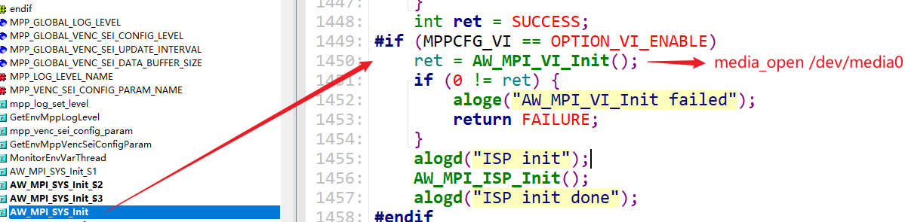


从媒体子系统里根据vin_video0找到/dev/video0节点：

```shell
CreateVIPP2VOLink
	AW_MPI_VI_CreateVipp(pLinkInfo->mVIDev);
		iRet = videoInputHw_Construct(ViDev);
		iRet = videoInputHw_ChnInit(ViDev);
        	if(isp_video_open(gpVIDevManager->media, ViCh) < 0)
        		video->priv = isp_md; // 前面media_open的返回值
        		ret = video_init(video);
        			// vin_video0
        			snprintf(name, sizeof(name), SUNXI_VIDEO"%d", (int)video->id);
        			
        			video->entity = media_get_entity_by_name(media->mdev, name);
        			
        			// /dev/video0
        			video->entity->fd = open(video->entity->devname, O_RDWR | O_NONBLOCK | O_CLOEXEC, 0);
        		
        		// 根据link找打对应的sunxi_isp.x
        		video->isp_id = media_video_to_isp_id(video->entity);
        			pad = media_entity_remote_source(pad);
```

如下图：

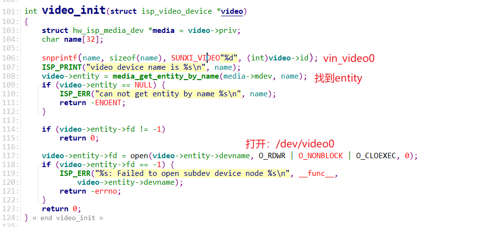


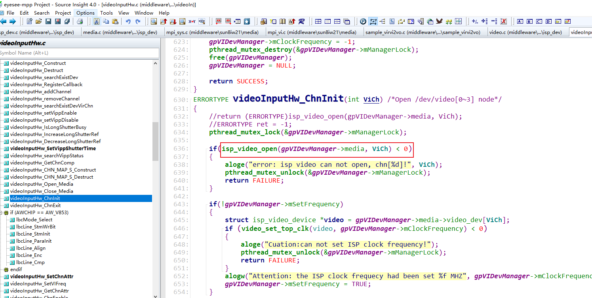