# IIO子系统简化框架及第1个驱动分析

IIO(Industrial I/O)参考资料：

* 系列文章：https://blog.csdn.net/lickylin/article/details/108177756
* https://www.cnblogs.com/yongleili717/p/10758691.html
* 内核文档：https://www.kernel.org/doc/html/v5.3/driver-api/iio


## 1. 传感器驱动需求与框架

### 1.1 怎么读取传感器数据

有多种多样的传感器：

* 没有中断信号
* 有中断信号

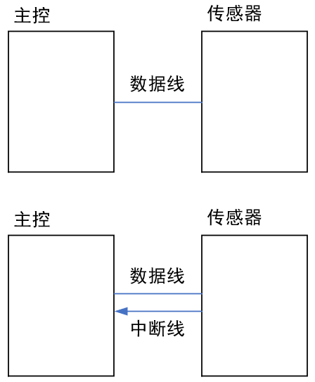


读取数据的方法也有多种：

* 发起一次读操作，得到一个数据
* 中断等方式触发数据采集，多个数据已经保存在buffer里，可以读多次

读取到的数据也有多种：

* 普通数据：单次数据
* 普通数据：存在buffer里的数据
* event数据：只是bit数据，表示超出极限了，比如温度超出设置的极限值


### 1.2 驱动程序框架

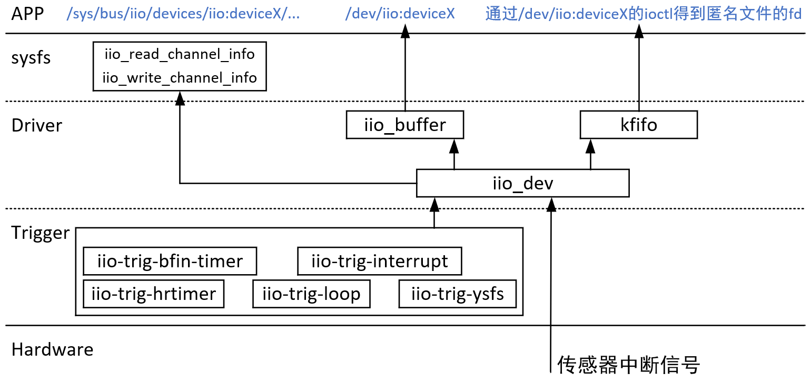


## 2. 最简单的IIO驱动程序分析_DHT11

### 2.1 DHT11操作原理与编程思路

#### 2.1.1 芯片介绍

简单地说，可以从DTH11中读取到温度值、湿度值。外形及引脚如下：

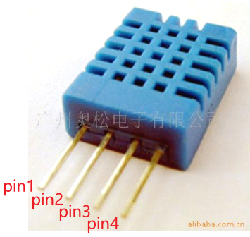


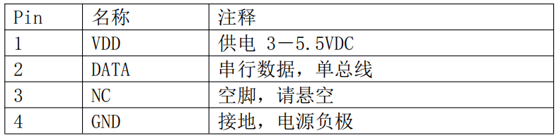


典型应用电路如下：

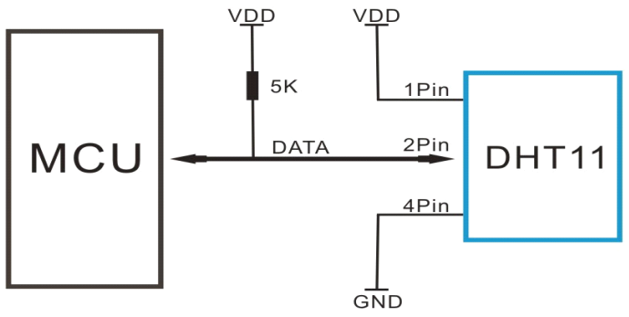

#### 2.1.2 数据格式

DHT11的data引脚用户传输数据，一次通讯时间为4ms作用，数据分为：整数部分、小数部分。
目前小数部分用具以后扩展，现读出为0。
一次完整的数据为40 bit，先传输高位：

* 格式为：8bit湿度整数数据 + 8bit湿度小数数据 + 8bit温度整数数据 + 8bit温度小数数据 + 8bit校验和
* 校验和 = "8bit湿度整数数据 + 8bit湿度小数数据 + 8bit温度整数数据 + 8bit温度小数数据" 所得结果的低8位


#### 2.1.3 通信协议

* 平时，DHT11处于低功耗模式

* MCU发送开始信号，让DHT11从低功耗模式转换为高速模式

* DHT11等待主机开始信号结束后，会发送响应信号

* DHT11发送40bit数据

* 通信过程如下：

  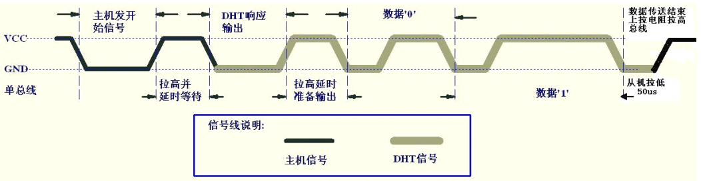

##### ① 开始信号

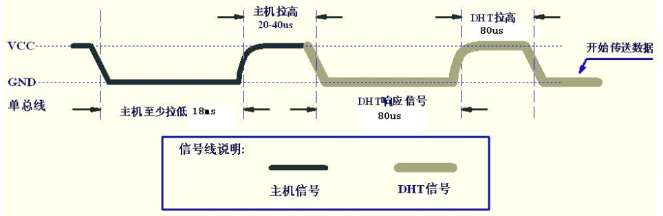

* 总线空闲状态位高电平
* 主机把总线拉低等待DHT11响应，主机把总线拉低必须大于18ms，保证DHT11等检测到开始信号
* DHT11接收到主机的开始信号后
  * 等待主机开始信号结束：主机要把信号拉高20-40us
    * 主机输出高电平，或者引脚设置为输入模式(通过上拉电阻拉高)
  * DHT11发送80us低电平响应信号
  * DHT11发送80us高电平


DHT11发送响应信号后，再把总线拉高80us，准备发送数据。
每一bit数据都以50us低电平时隙开始，高电平的长短用来分辨是数据0还是1。

##### ② 数据0

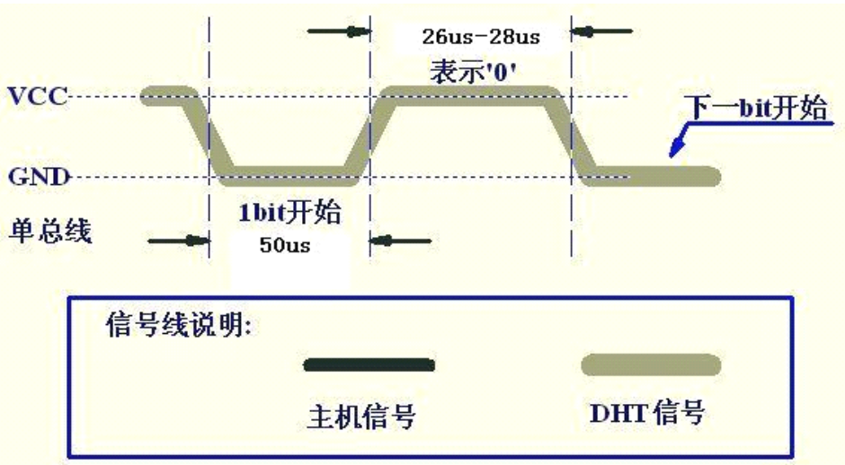


##### ③ 数据1

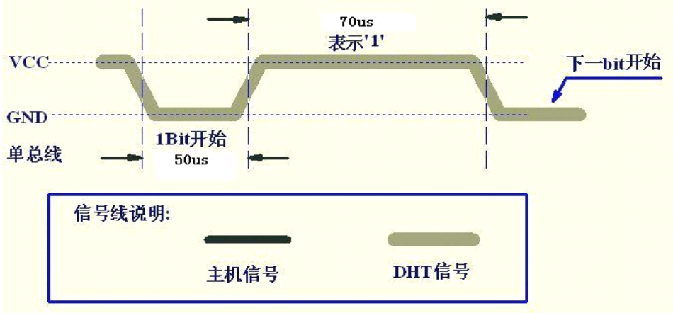


#### 2.1.3 传统字符设备驱动编程思路

启动DHT11后，使用中断记录中断时刻的时间，当中断次数达标后，根据这些时间解析出数据。


### 2.2 IIO子系统DHT11驱动体验_IMX6ULL

#### 2.2.1 设备树修改

参考内核文档`Documentation\devicetree\bindings\iio\humidity\dht11.txt`：

* 对于IMX6ULL，修改`arch/arm/boot/dts/`目录下100ask_imx6ull-14x14.dts或100ask_imx6ull_mini.dts，增加如下节点：

  ```shell
  humidity_sensor {
  	compatible = "dht11";
      gpios = <&gpio4 19 GPIO_ACTIVE_HIGH>;
  };
  ```

  

#### 2.2.2 编译更新设备树、驱动

```shell
make dtbs
make modules
```

把编译得到的100ask_imx6ull-14x14.dtb放到开发板的/boot目录。

把编译得到的drivers/iio/humidity/dht11.ko放到开发板的/root目录。


#### 2.2.3 去掉板子自带的驱动

```shell
mv /etc/init.d/S09modload /root
reboot
```


#### 2.2.4 接模块

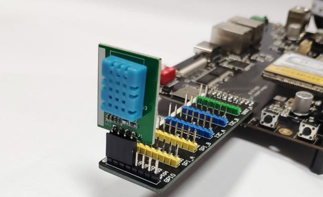


#### 2.2.5 体验驱动

```shell
cd /root
insmod dht11.ko

cd /sys/bus/iio/devices/iio:device2

while [ 1 ]; do cat in_humidityrelative_input ; sleep 1; done

while [ 1 ]; do cat in_temp_input ; sleep 1; done
```


#### 2.2.5 改进驱动

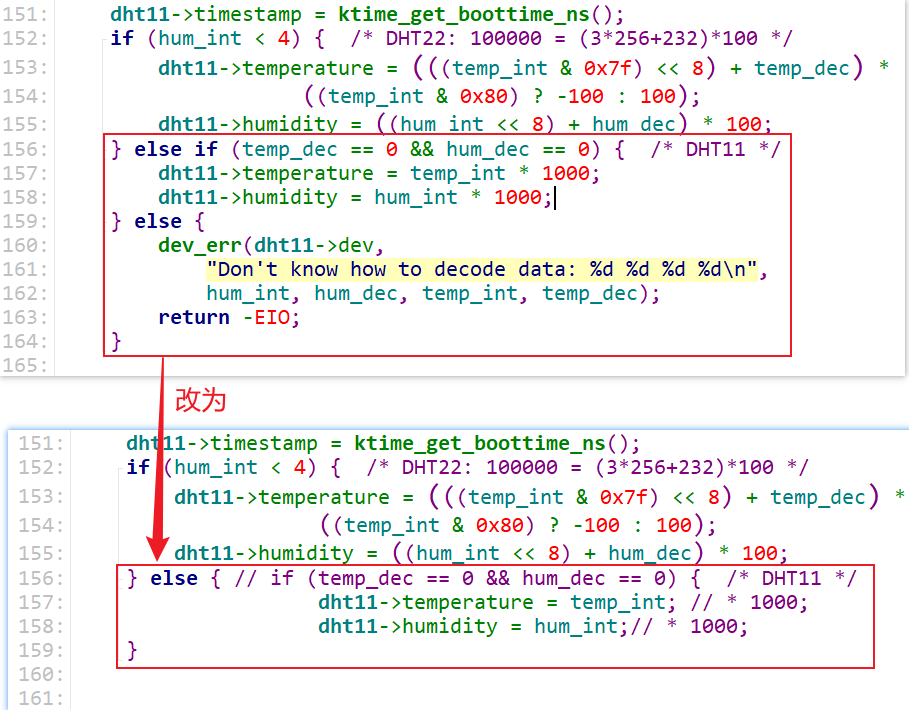


### 2.2 IIO子系统DHT11驱动体验_STM32MP157

#### 2.2.1 设备树修改

参考内核文档`Documentation\devicetree\bindings\iio\humidity\dht11.txt`：

* 对于STM32MP157，修改`arch/arm/boot/dts/stm32mp157c-100ask-512d-lcd-v1.dts`，在根节点下添加如下节点：：

  ```shell
  humidity_sensor {
  	compatible = "dht11";
      gpios = <&gpioa 5 GPIO_ACTIVE_HIGH>;
  };
  ```

  

#### 2.2.2 编译更新设备树、驱动

在Ubutnu上：

```shell
make dtbs
make modules
```

在开发板上，需要先挂载/boot分区，命令如下：

```shell
mount  /dev/mmcblk2p2  /boot  ; 可能已经挂载过,再挂载一次会提示错误,没有关系
```

然后：

把编译得到的stm32mp157c-100ask-512d-lcd-v1.dtb放到开发板的/boot目录。

把编译得到的drivers/iio/humidity/dht11.ko放到开发板的/root目录。


#### 2.2.3 接模块

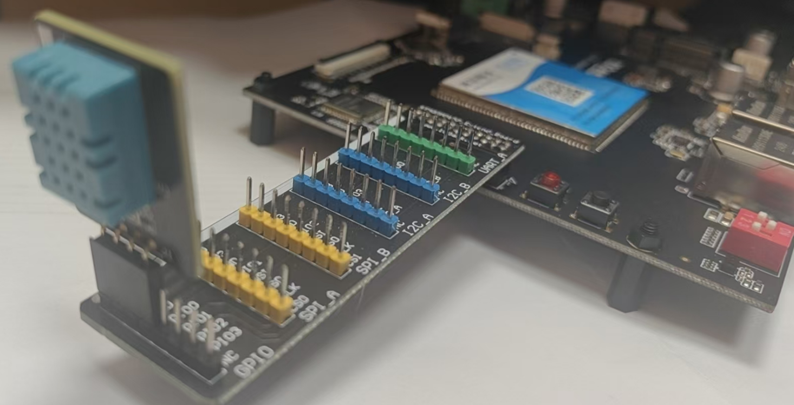


#### 2.2.4 体验驱动

```shell
cd /root
insmod dht11.ko

cd /sys/bus/iio/devices/iio:device1

while [ 1 ]; do cat in_humidityrelative_input ; sleep 1; done

while [ 1 ]; do cat in_temp_input ; sleep 1; done
```


#### 2.2.5 改进驱动


### 2.3 DHT11的IIO驱动分析

#### 2.3.1 驱动套路

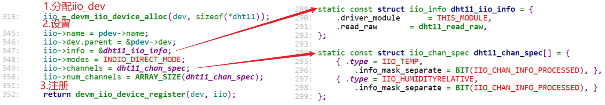

#### 2.3.2 驱动层次

DHT11驱动只涉及下图红色部分：

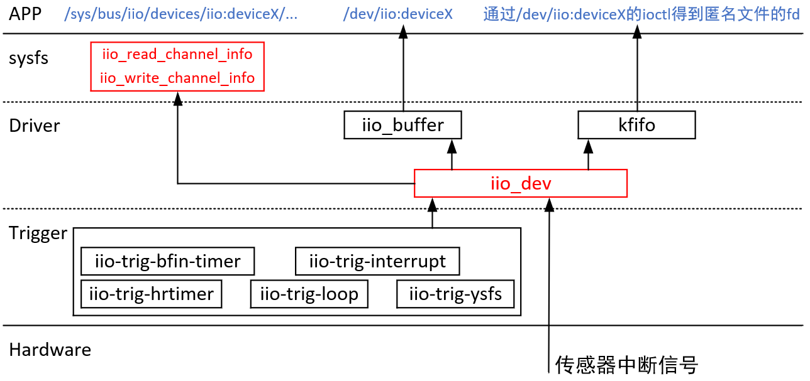

#### 2.3.3 情景分析

注册：

```shell
dht11_probe
	devm_iio_device_register
		iio_device_register
			iio_device_register_sysfs
				// 对于每一个channel
				ret = iio_device_add_channel_sysfs(indio_dev, chan);
					iio_device_add_info_mask_type
                        ret = __iio_add_chan_devattr(iio_chan_info_postfix[i],
                                         chan,
                                         &iio_read_channel_info,
                                         &iio_write_channel_info,
                                         i,
                                         shared_by,
                                         &indio_dev->dev,
                                         &indio_dev->channel_attr_list);

```


使用：

```shell
cat /sys/bus/iio/devices/iio:device2/in_humidityrelative_input
	iio_read_channel_info
		ret = indio_dev->info->read_raw(indio_dev, this_attr->c,
				    &vals[0], &vals[1], this_attr->address);
				dht11_read_raw
                    if (chan->type == IIO_TEMP)
                        *val = dht11->temperature;
                    else if (chan->type == IIO_HUMIDITYRELATIVE)
                        *val = dht11->humidity;
```


### 2.4 通道的sysfs信息修改与体验

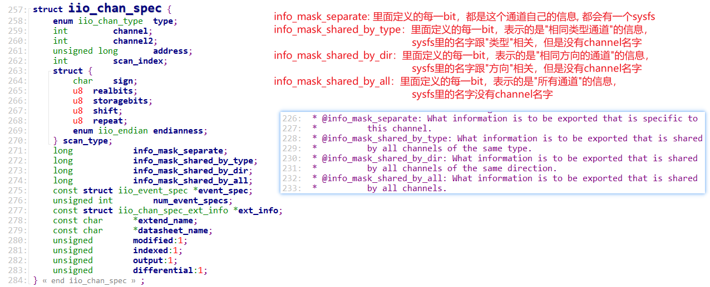


## 笔记

### 1. iio_buffer初始化

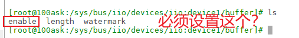

```shell
static DEVICE_ATTR(enable, S_IRUGO | S_IWUSR,
		   iio_buffer_show_enable, iio_buffer_store_enable);
iio_buffer_store_enable > __iio_update_buffers > iio_enable_buffers

iio_channel_start_all_cb > iio_update_buffers > __iio_update_buffers  > iio_enable_buffers

	ret = indio_dev->setup_ops->postenable(indio_dev);
		iio_triggered_buffer_postenable
			iio_trigger_attach_poll_func(indio_dev->trig,
					    indio_dev->pollfunc);
					    
					    pf->irq = iio_trigger_get_irq(trig);
				    	/* Request irq */
                        ret = request_threaded_irq(pf->irq, pf->h, pf->thread,
                                       pf->type, pf->name,
                                       pf);

					    ret = trig->ops->set_trigger_state(trig, true);


```

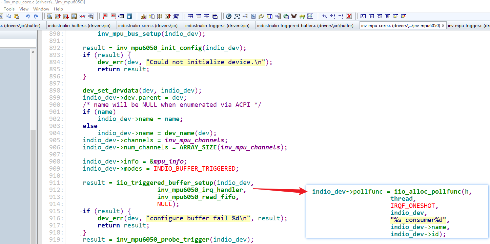


### 2. 从硬件中断到APP


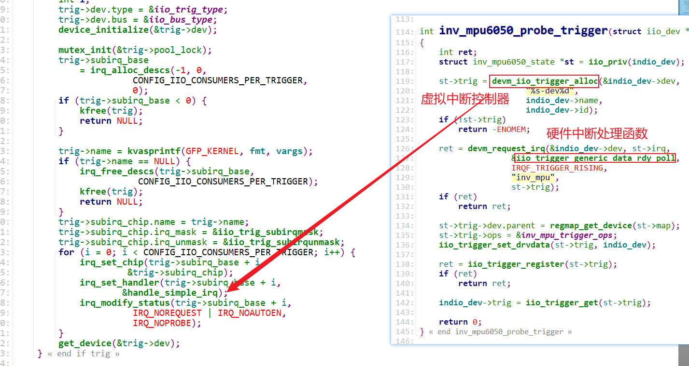


```shell
iio_trigger_generic_data_rdy_poll
	iio_trigger_poll(private);
		generic_handle_irq(trig->subirq_base + i);
			handle_simple_irq
				inv_mpu6050_irq_handler
					kfifo_in_spinlocked(&st->timestamps, &timestamp, 1, // 记录时间
				inv_mpu6050_read_fifo
					regmap_bulk_read // 读数据
					result = kfifo_out(&st->timestamps, &timestamp, 1); // 取出时间
					// 数据和时间一起存进去
					result = iio_push_to_buffers_with_timestamp(indio_dev, data, timestamp);
							iio_push_to_buffers
								iio_push_to_buffer(buf, data);
									ret = buffer->access->store_to(buffer, dataout);
									wake_up_interruptible_poll(&buffer->pollq, POLLIN | POLLRDNORM);
```

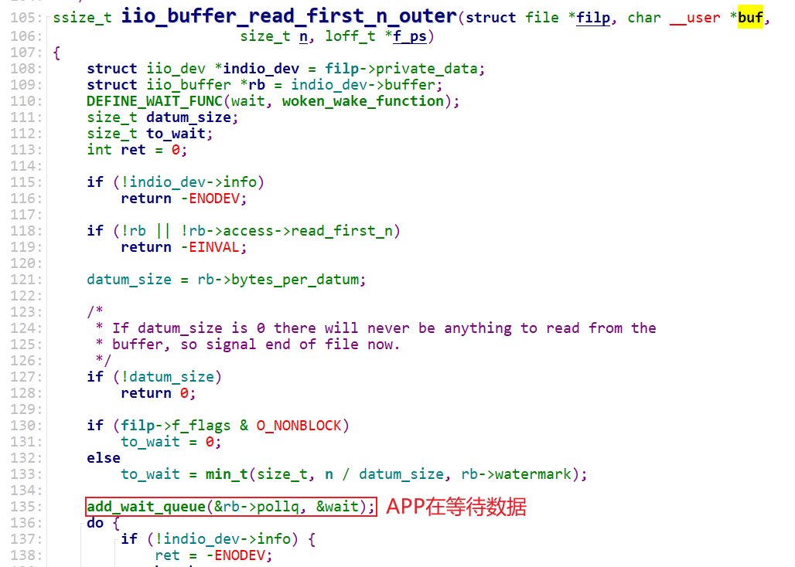


无论使用哪种trigger，都要实现调用iio_triggered_buffer_setup，就是提供trigger的中断处理函数：

```c
	result = iio_triggered_buffer_setup(indio_dev,
					    inv_mpu6050_irq_handler,
					    inv_mpu6050_read_fifo,
					    NULL);
```

无论是硬件中断触发、sysfs触发、其他触发，最终都是调用：iio_trigger_poll(trig->trig);，这会调用trigger的虚拟中断控制器里的中断处理函数，最终调用到iio_triggered_buffer_setup里提供的中断处理函数。


使用iio_buffer

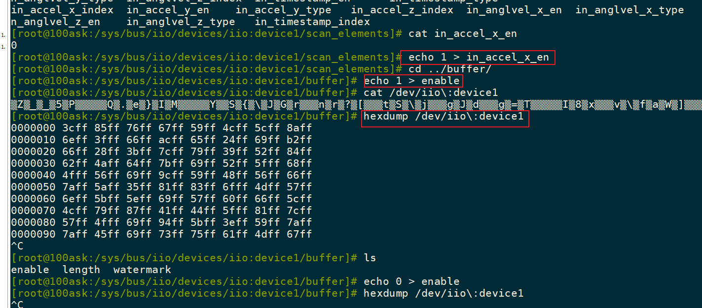


### 3. event

内核：

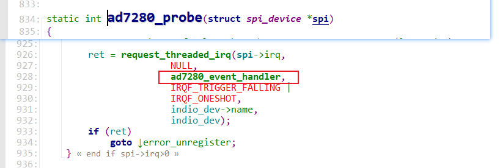

```shell
ad7280_event_handler
    iio_push_event
        copied = kfifo_put(&ev_int->det_events, ev);
```


APP：

```shell
iio_ioctl IIO_GET_EVENT_FD_IOCTL
	fd = iio_event_getfd(indio_dev);
            fd = anon_inode_getfd("iio:event", &iio_event_chrdev_fileops,
                        indio_dev, O_RDONLY | O_CLOEXEC);
		
```


