# iio_buffer的使用

IIO(Industrial I/O)参考资料：

* 系列文章：https://blog.csdn.net/lickylin/article/details/108177756
* https://www.cnblogs.com/yongleili717/p/10758691.html
* 内核文档：https://www.kernel.org/doc/html/v5.3/driver-api/iio
* 参考内核源码：`drivers\staging\iio\impedance-analyzer\ad5933.c`


## 1. iio_buffer的核心要素与体验

### 1.1 问题引入

以DHT11为例，读取`/sys/bus/iio/devices/iio:device2/in_temp_input`时，读一次得到一个数据。如果想得到连续的数据，就要使用iio_buffer：

* 驱动程序内部读取多次数据，把数据存在iio_buffer里
* APP读取/dev/iio:deviceX节点，可以一次读到多个数据

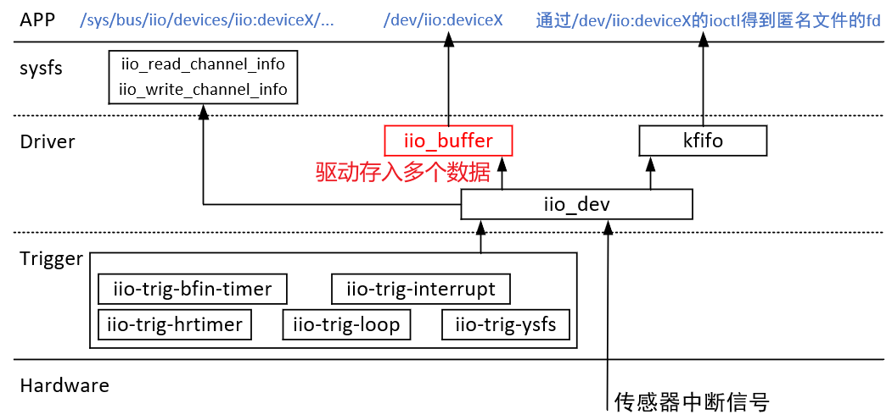


以DHT11为例，它有2个通道：温度、湿度，那么读取到的数据格式是怎样的？有如下4种组合：

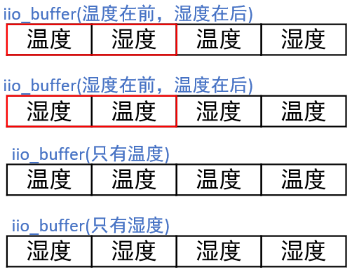


使用iio_buffer读数据时，APP要解决这些问题：

* 只想读温度或湿度，或者想同时读取温度和湿度，怎么设置？
* 读到的数据里，怎么分辨哪些是温度、哪些是湿度？

驱动程序把数据存入iio_buffer时，驱动要解决这些问题：

* 怎么向APP表示数据的格式：比如温度占据多少bit数据、湿度占据多少bit数据


### 1.2 数据如何排列

在驱动程序里，对于每个通道，数据的格式如下描述：

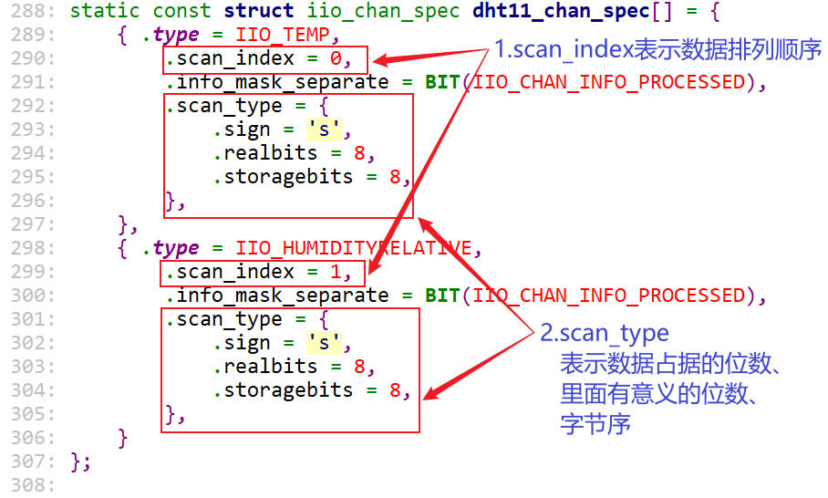


对于APP，可以如下操作看到这些：

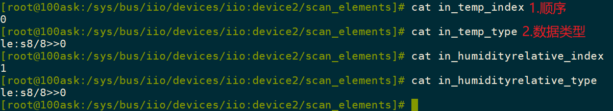


### 1.3 如何使能/禁止某个通道

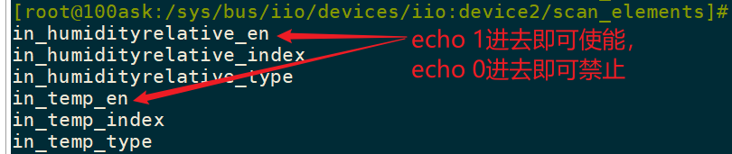


### 1.4 如何使能/禁止iio_buffer

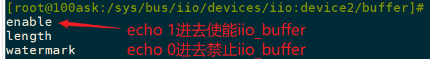


### 1.5 如何读取buffer

读取设备节点即可，比如：

```shell
hexdump /dev/iio\:device2
```

注意：hexdump读到16个字节的数据才会打印出来，如果看到打印缓慢，这是正常的。


### 1.6 上机体验

IMX6ULL的源码：

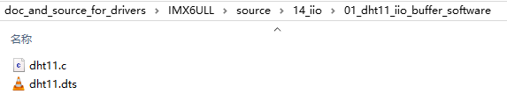


STM32MP157的源码：

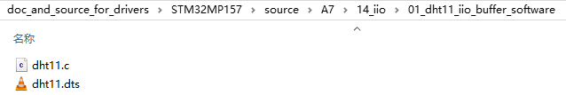

## 2. 修改DHT11驱动使用iio_buffer

IMX6ULL的源码：

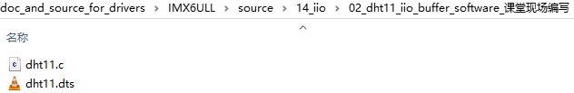


STM32MP157的源码：

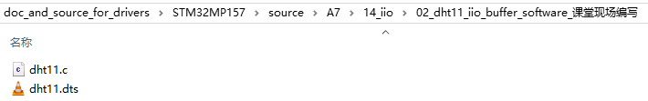

### 2.1 增加iio_buffer并体验sysfs

#### 2.1.1 驱动核心代码

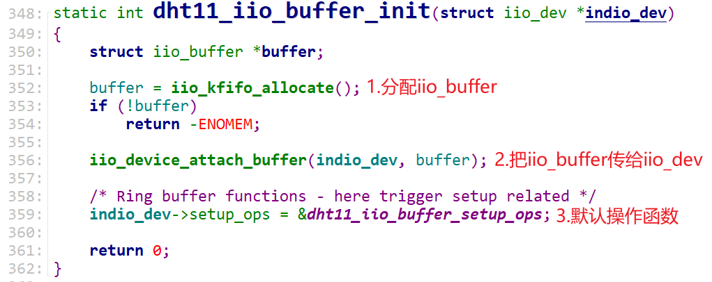


#### 2.1.2 buffer目录下的sysfs文件

`/sys/bus/iio/devices/iio:deviceX/buffer`目录下有如下文件：

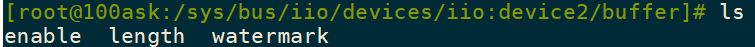

这几个文件对应的读写函数如下：

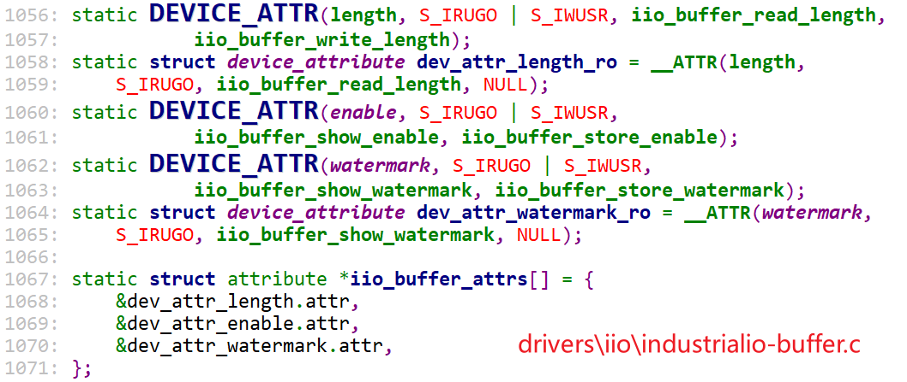

调用过程：

```shell
dht11_probe
	devm_iio_device_register
		iio_device_register
			ret = iio_buffer_alloc_sysfs_and_mask(indio_dev);
				// 对应/sys/bus/iio/devices/iio:deviceX/buffer
				memcpy(attr, iio_buffer_attrs, sizeof(iio_buffer_attrs));
				buffer->buffer_group.name = "buffer";
				buffer->buffer_group.attrs = attr;
```


#### 2.1.3 scan_elements目录下的sysfs文件

`/sys/bus/iio/devices/iio:deviceX/scan_elements`目录下有如下文件：

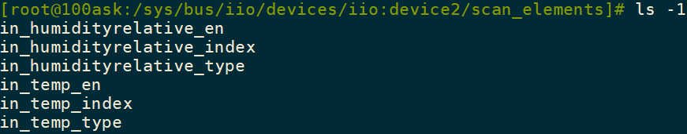

这几个文件对应的读写函数如下：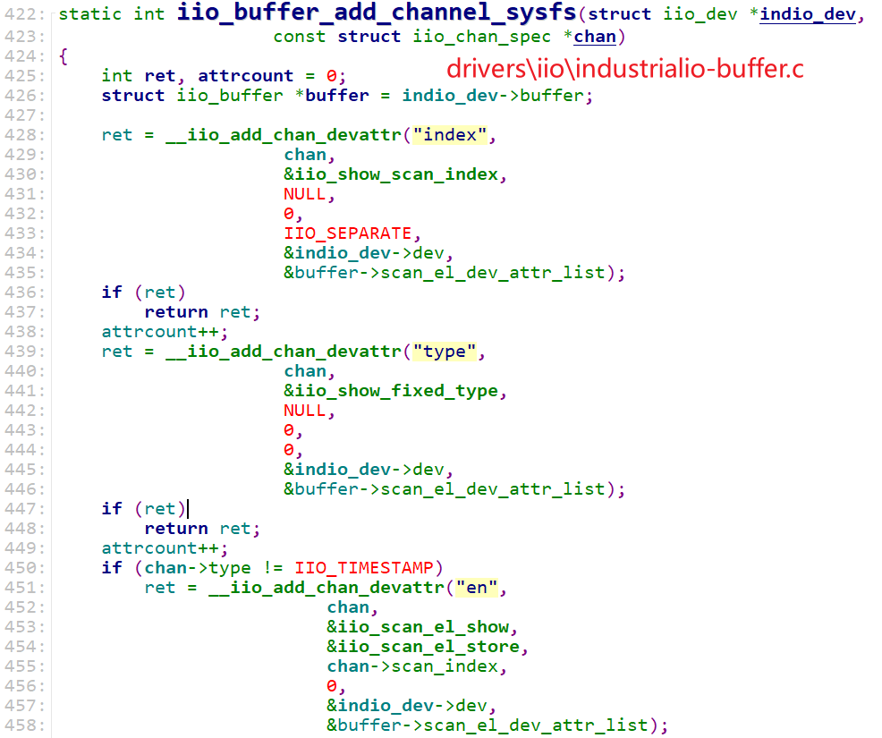


调用过程：

```shell
dht11_probe
	devm_iio_device_register
		iio_device_register
			ret = iio_buffer_alloc_sysfs_and_mask(indio_dev);
				// 对应/sys/bus/iio/devices/iio:deviceX/buffer
				memcpy(attr, iio_buffer_attrs, sizeof(iio_buffer_attrs));
				buffer->buffer_group.name = "buffer";
				buffer->buffer_group.attrs = attr;
			
            // 对于每一个channel
			for (i = 0; i < indio_dev->num_channels; i++) {
				ret = iio_buffer_add_channel_sysfs(indio_dev,&channels[i]);
            }
```


#### 2.1.4 上机体验

需要添加如下信息：

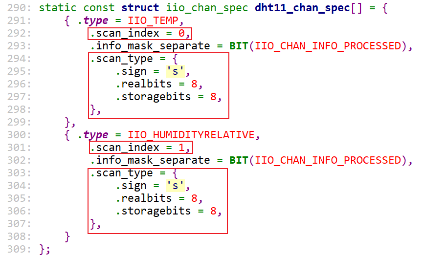


### 2.2 实现iio_buffer的写入

#### 2.2.1 设计思路

DHT11没有中断引脚，DHT11的访问比较慢。如何启动数据的采集？最好的办法是使用内核线程。工作队列(work)的上下文就在内核线程里，我们可以使用工作队列来读DHT11。


#### 2.2.2 编程要点

* 分配、设置工作队列
  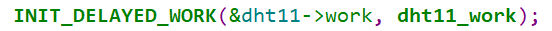
* 使能buffer后启动工作队列
  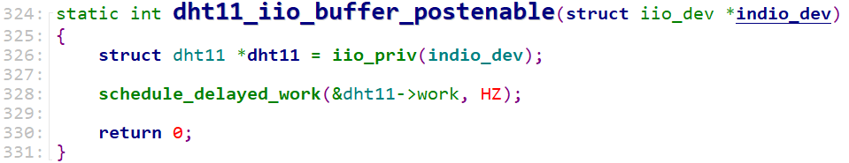
* 工作队列里读取数据、再次启动工作队列
  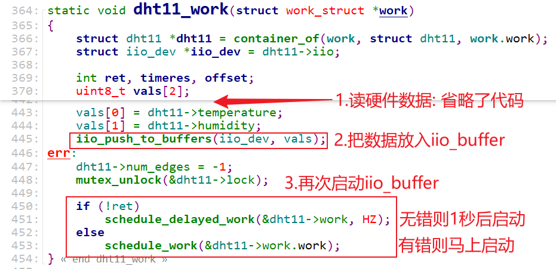
* 停止buffer后取消工作队列
  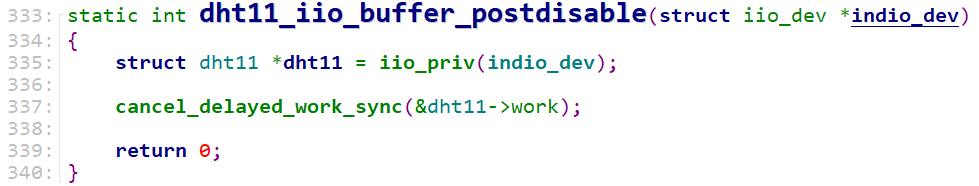

#### 2.2.3 细节

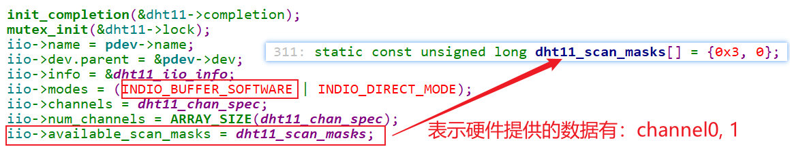


## 笔记

### 1. iio_buffer初始化


```shell
static DEVICE_ATTR(enable, S_IRUGO | S_IWUSR,
		   iio_buffer_show_enable, iio_buffer_store_enable);
iio_buffer_store_enable > __iio_update_buffers > iio_enable_buffers

iio_channel_start_all_cb > iio_update_buffers > __iio_update_buffers  > iio_enable_buffers

	ret = indio_dev->setup_ops->postenable(indio_dev);
		iio_triggered_buffer_postenable
			iio_trigger_attach_poll_func(indio_dev->trig,
					    indio_dev->pollfunc);
					    
					    pf->irq = iio_trigger_get_irq(trig);
				    	/* Request irq */
                        ret = request_threaded_irq(pf->irq, pf->h, pf->thread,
                                       pf->type, pf->name,
                                       pf);

					    ret = trig->ops->set_trigger_state(trig, true);


```


#### 1.1 iio_buffer细节

```shell
echo 1 > /sys/bus/iio/devices/iio:device2/buffer/enable
iio_buffer_store_enable
    __iio_update_buffers
        iio_buffer_request_update
            iio_buffer_update_bytes_per_datum
                buffer->access->set_bytes_per_datum(buffer, bytes);
                    iio_set_bytes_per_datum_kfifo
                        r->bytes_per_datum = bpd;
             ret = buffer->access->request_update(buffer);
```


### 2. 从硬件中断到APP


```shell
iio_trigger_generic_data_rdy_poll
	iio_trigger_poll(private);
		generic_handle_irq(trig->subirq_base + i);
			handle_simple_irq
				inv_mpu6050_irq_handler
					kfifo_in_spinlocked(&st->timestamps, &timestamp, 1, // 记录时间
				inv_mpu6050_read_fifo
					regmap_bulk_read // 读数据
					result = kfifo_out(&st->timestamps, &timestamp, 1); // 取出时间
					// 数据和时间一起存进去
					result = iio_push_to_buffers_with_timestamp(indio_dev, data, timestamp);
							iio_push_to_buffers
								iio_push_to_buffer(buf, data);
									ret = buffer->access->store_to(buffer, dataout);
									wake_up_interruptible_poll(&buffer->pollq, POLLIN | POLLRDNORM);
```


无论使用哪种trigger，都要实现调用iio_triggered_buffer_setup，就是提供trigger的中断处理函数：

```c
	result = iio_triggered_buffer_setup(indio_dev,
					    inv_mpu6050_irq_handler,
					    inv_mpu6050_read_fifo,
					    NULL);
```

无论是硬件中断触发、sysfs触发、其他触发，最终都是调用：iio_trigger_poll(trig->trig);，这会调用trigger的虚拟中断控制器里的中断处理函数，最终调用到iio_triggered_buffer_setup里提供的中断处理函数。


使用iio_buffer


### 3. event

内核：


```shell
ad7280_event_handler
    iio_push_event
        copied = kfifo_put(&ev_int->det_events, ev);
```


APP：

```shell
iio_ioctl IIO_GET_EVENT_FD_IOCTL
	fd = iio_event_getfd(indio_dev);
            fd = anon_inode_getfd("iio:event", &iio_event_chrdev_fileops,
                        indio_dev, O_RDONLY | O_CLOEXEC);
		
```


