# iio_trigger的使用

IIO(Industrial I/O)参考资料：

* 系列文章：https://blog.csdn.net/lickylin/article/details/108177756
* https://www.cnblogs.com/yongleili717/p/10758691.html
* 内核文档：https://www.kernel.org/doc/html/v5.3/driver-api/iio
* 参考内核源码：`drivers\staging\iio\impedance-analyzer\ad5933.c`


## 1. iio_trigger的引入与体验

### 1.1 问题引入

在上一个驱动程序里，我们使用工作队列：读DHT11、写Buffer。

工作队列的本质是：在一个内核线程(worker线程)里，执行我们提供的work函数。

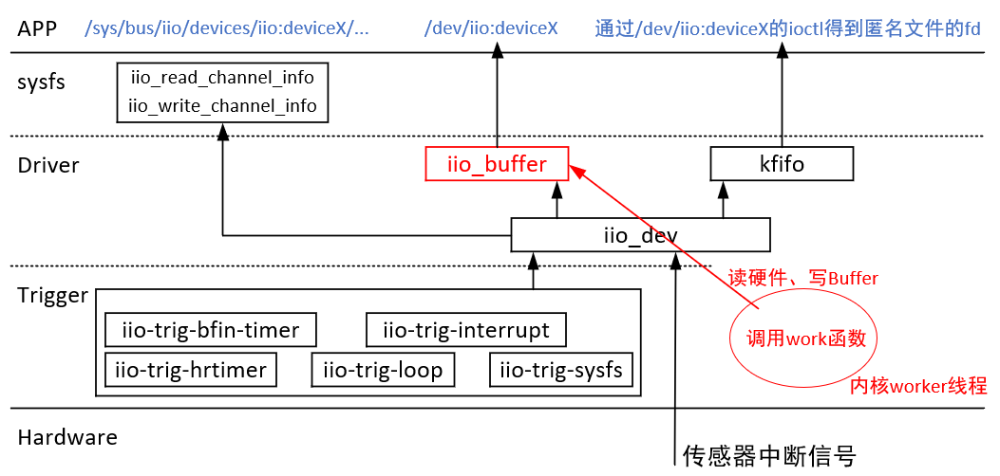

我们想使用更多的读数据方式，怎么办？比如：

* 类似我们实现的使用内核线程不断读硬件、写buffer
* 用户手工触发一次读硬件、写buffer
* 使用其他中断，比如按键，按一下触发一次读硬件、写buffer
* 定时触发一次读硬件、写buffer

内核里已经实现了多种"iio-trigger"，比如：

* iio-trig-loop：本质就是使用一个内核线程，不断读硬件、写buffer
* iio-trig-sysfs：用户写一下某个sysfs文件，就读一次硬件、写buffer
* iio-trig-interrupt：可以使用其他中断来读硬件、写buffer
* iio-trig-hrtimer：使用定时器，周期性地读硬件、写buffer


### 1.2 trigger的概念

要使用trigger，首先得有驱动程序：配置内核，把如下驱动选上

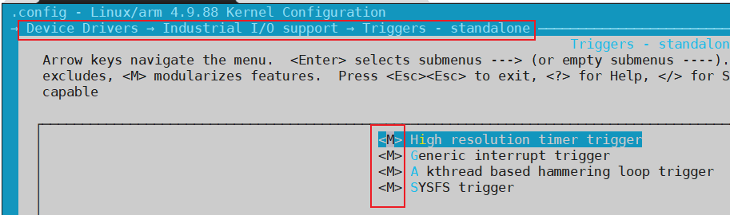


然后创建trigger：比如按照驱动程序iio-trig-loop.ko后，还需要执行如下命令来创建触发器：

```shell
mkdir  /sys/kernel/config/iio/triggers/loop/loop0
```


然后，要设置IIO设备使用触发器，比如：

```shell
insmod /root/dht11.ko
cd /sys/bus/iio/devices/iio\:device2/
echo loop0 > trigger/current_trigger                        # 在设备上使用trigger
```


最后：使能iio device的buffer、读设备


### 1.3 上机体验

IMX6ULL的源码：

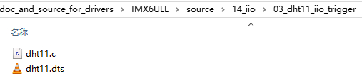

STM32MP157的源码：

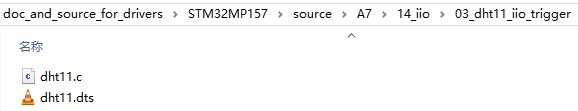

#### 1.3.1 IMX6ULL

```shell
insmod /root/iio-trig-loop.ko
mkdir  /sys/kernel/config/iio/triggers/loop/loop0  # 创建trigger
cat /sys/bus/iio/devices/trigger1/name             # 可以看到这个trigger

insmod /root/dht11.ko
cd /sys/bus/iio/devices/iio\:device2/
echo loop0 > trigger/current_trigger               # 在设备上使用trigger

echo 1 > scan_elements/in_humidityrelative_en
echo 1 > scan_elements/in_temp_en
echo 1 > buffer/enable

hexdump /dev/iio\:device2
```


#### 1.3.2 STM32MP157

```SHELL
insmod /root/iio-trig-loop.ko
mkdir  /sys/kernel/config/iio/triggers/loop/loop0  # 创建trigger
cat /sys/bus/iio/devices/trigger1/name             # 可以看到这个trigger

insmod /root/dht11.ko
cd /sys/bus/iio/devices/iio\:device1/
echo loop0 > trigger/current_trigger               # 在设备上使用trigger

echo 1 > scan_elements/in_humidityrelative_en
echo 1 > scan_elements/in_temp_en
echo 1 > buffer/enable

hexdump /dev/iio\:device1
```


## 2. iio_trigger内部机制

以`drivers\iio\trigger\iio-trig-loop.c`为例进行分析：

### 2.1 核心：虚拟中断控制器

iio_trigger的核心是使用"虚拟中断控制器"来实现驱动的分离：

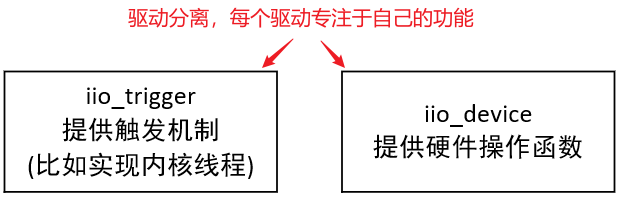

以iio_trig-loop.c为例：

* iio_trig-loop.c实现了一个虚拟中断控制器
* DHT11提供虚拟的中断处理函数
* 当使能DHT11的buffer时，向虚拟中断控制器注册中断
* iio_trig-loop.c的线程调用`iio_trigger_poll_chained`函数直接调用中断处理函数
* **注意**：没有真正的中断产生

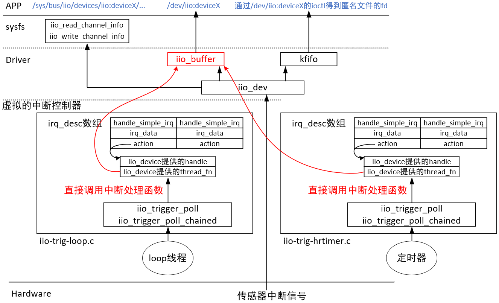

### 2.2 注册iio_trigger驱动

执行如下命令：

```shell
insmod /root/iio-trig-loop.ko
```

会生成一个目录（以后在此目录下mkdir，就会创建trigger设备，即创建虚拟中断控制器）：

```shell
/sys/kernel/config/iio/triggers/loop
```

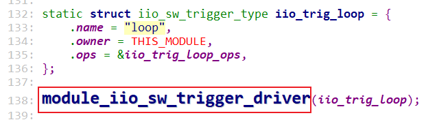

### 2.3 创建trigger设备：创建虚拟中断控制器

执行如下命令：

```shell
mkdir  /sys/kernel/config/iio/triggers/loop/loop0  # 创建trigger
cat /sys/bus/iio/devices/trigger1/name             # 可以看到这个trigger
```

就会创建trigger设备，就是创建虚拟中断控制器：

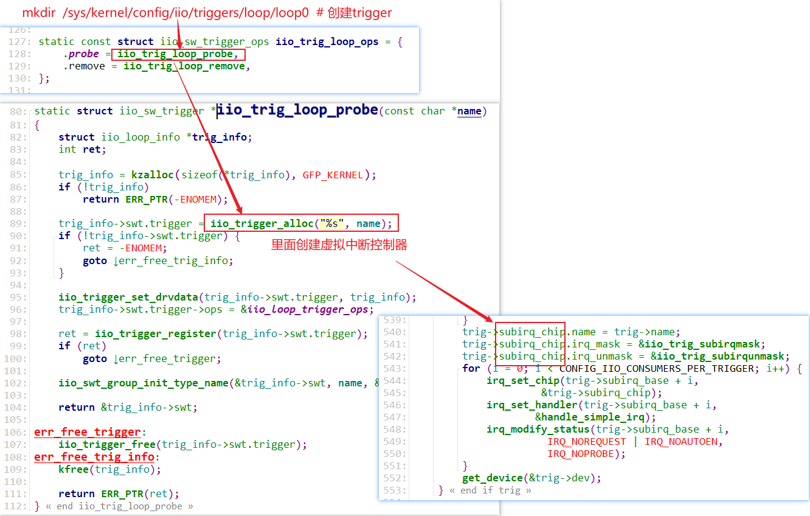


### 2.4 iio_device使用trigger设备

iio_device要使用trigger功能，就是去注册一个中断，这个中断是trigger设备提供的虚拟的中断。

#### 2.4.1 准备中断函数

创建buffer时提供handler、thread_fn：

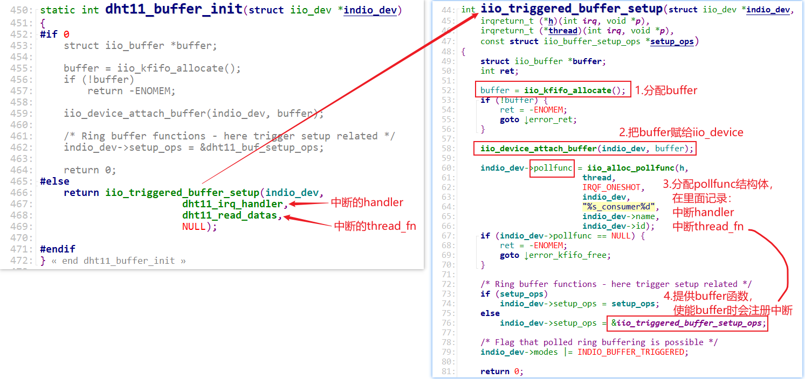

#### 2.4.2 注册中断函数

使能buffer时注册中断函数，执行如下命令时：

```shell
echo 1 > scan_elements/in_humidityrelative_en
echo 1 > scan_elements/in_temp_en
echo 1 > buffer/enable
```

会有如下调用：

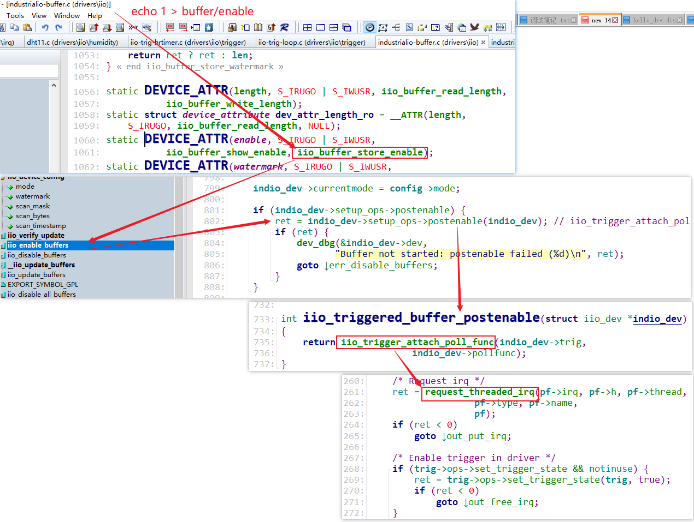

### 2.5 trigger设备调用中断处理函数

使能buffer时，会设置trigger的状态为true：

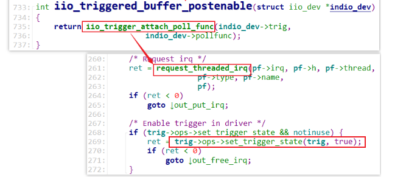

对于iio-trig-loop.c:

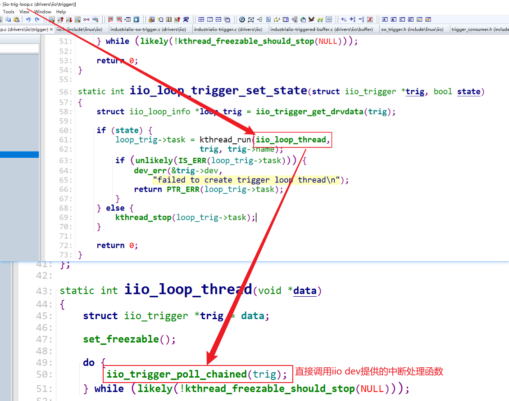


iio_trigger_poll_chained会直接调用iio_device提供的中断处理函数：

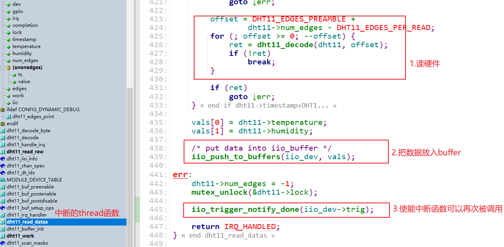


## 3. iio-trig-hrtimer分析

### 3.1 注册trigger驱动

```shell
insmod iio-trig-hrtimer.ko
ls /sys/kernel/config/iio/triggers/hrtimer/
```


### 3.2 创建trigger设备

```shell
cd /sys/kernel/config/iio/triggers/hrtimer/
mkdir timer_abc

# ls /sys/bus/iio/devices/trigger1/
name                power/              sampling_frequency  subsystem/          uevent
# cat /sys/bus/iio/devices/trigger1/name
timer_abc

```


### 3.3 使用

#### 3.3.1 IMX6ULL

```shell
insmod /root/iio-trig-hrtimer.ko
mkdir  /sys/kernel/config/iio/triggers/hrtimer/timer_abc  # 创建trigger
cat /sys/bus/iio/devices/trigger1/name             # 可以看到这个trigger

insmod /root/dht11.ko
cd /sys/bus/iio/devices/iio\:device2/
echo timer_abc > trigger/current_trigger               # 在设备上使用trigger

echo 1 > scan_elements/in_humidityrelative_en
echo 1 > scan_elements/in_temp_en
echo 1 > buffer/enable

hexdump /dev/iio\:device2

# 修改频率
cd /sys/bus/iio/devices/trigger1
echo 1000000000 > sampling_frequency  # 单位ns
```


#### 3.3.2 STM32MP157

```SHELL
# insmod /root/iio-trig-hrtimer.ko # 157上已经有了这个驱动
mkdir  /sys/kernel/config/iio/triggers/hrtimer/timer_abc  # 创建trigger
cat /sys/bus/iio/devices/trigger1/name             # 可以看到这个trigger

insmod /root/dht11.ko
cd /sys/bus/iio/devices/iio\:device1/
echo timer_abc > trigger/current_trigger               # 在设备上使用trigger

echo 1 > scan_elements/in_humidityrelative_en
echo 1 > scan_elements/in_temp_en
echo 1 > buffer/enable

hexdump /dev/iio\:device1

# 修改频率
cd /sys/bus/iio/devices/trigger1
echo 1000000000 > sampling_frequency  # 单位ns
```


## 4. 修改DHT11驱动使用iio_trigger

IMX6ULL的源码：

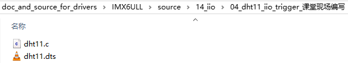


STM32MP157的源码：

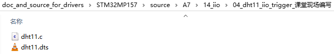

### 4.1 设置triggered_buffer

核心有2点：

* 设置pollfunc结构体，里面记录有虚拟中断处理函数：handle、thread_fn
* 提供setup_ops，它里面有postenable函数指针，用来在使能buffer时注册虚拟的中断

IIO子系统里提供了现成的函数：

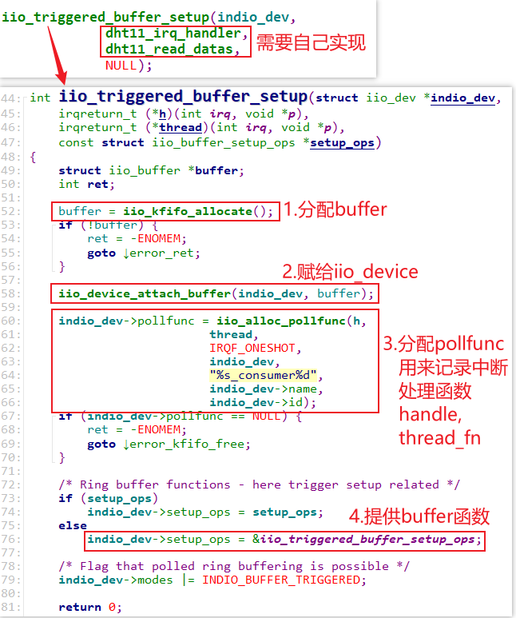


### 4.2 实现中断处理函数

先实现handle函数：

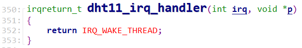


再实现thread_fn函数：

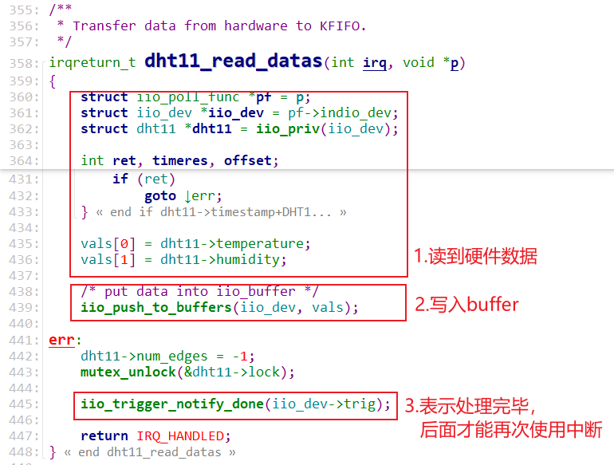


### 4.3 上机实验

#### 4.3.1 IMX6ULL

```shell
insmod /root/iio-trig-hrtimer.ko
mkdir  /sys/kernel/config/iio/triggers/hrtimer/timer_abc  # 创建trigger
cat /sys/bus/iio/devices/trigger1/name             # 可以看到这个trigger

insmod /root/dht11.ko
cd /sys/bus/iio/devices/iio\:device2/
echo timer_abc > trigger/current_trigger               # 在设备上使用trigger

echo 1 > scan_elements/in_humidityrelative_en
echo 1 > scan_elements/in_temp_en
echo 1 > buffer/enable

hexdump /dev/iio\:device2

# 修改频率
cd /sys/bus/iio/devices/trigger1
echo 1000000000 > sampling_frequency  # 单位ns
```


#### 4.3.2 STM32MP157

```shell
# insmod /root/iio-trig-hrtimer.ko # 157上已经有了这个驱动
mkdir  /sys/kernel/config/iio/triggers/hrtimer/timer_abc  # 创建trigger
cat /sys/bus/iio/devices/trigger1/name             # 可以看到这个trigger

insmod /root/dht11.ko
cd /sys/bus/iio/devices/iio\:device1/
echo timer_abc > trigger/current_trigger               # 在设备上使用trigger

echo 1 > scan_elements/in_humidityrelative_en
echo 1 > scan_elements/in_temp_en
echo 1 > buffer/enable

hexdump /dev/iio\:device1

# 修改频率
cd /sys/bus/iio/devices/trigger1
echo 1000000000 > sampling_frequency  # 单位ns
```


### 4.4 代码调用流程回顾


