# iio_event的使用

IIO(Industrial I/O)参考资料：

* 系列文章：https://blog.csdn.net/lickylin/article/details/108177756
* https://www.cnblogs.com/yongleili717/p/10758691.html
* 内核文档：https://www.kernel.org/doc/html/v5.3/driver-api/iio
* 参考内核源码
  * `drivers\staging\iio\impedance-analyzer\ad5933.c`
  * `drivers\iio\adc\hi8435.c`


## 1. iio_event的引入与体验

### 1.1 问题引入与解决方法

以温湿度传感器为例，它的温度值超过极限了，APP如何检测到这个事件？

* APP读取某个设备文件
* 传感器驱动提供数据：
  * 比如硬件监测到温度超标时，触发硬件中断，在中断里使用iio_push_event把"事件"写入kfifo
  * APP读取kfifo得到"事件"
* iio_trigger提供数据：
  * 有些硬件没有中断引脚，那么可以使用iio_trigger
  * iio_trigger直接调用驱动程序提供的的另一个"虚拟中断处理函数"(跟iio_buffer不一样的中断处理函数)
  * 这个中断处理函数读取硬件数据，使用iio_push_event把"事件"写入kfifo

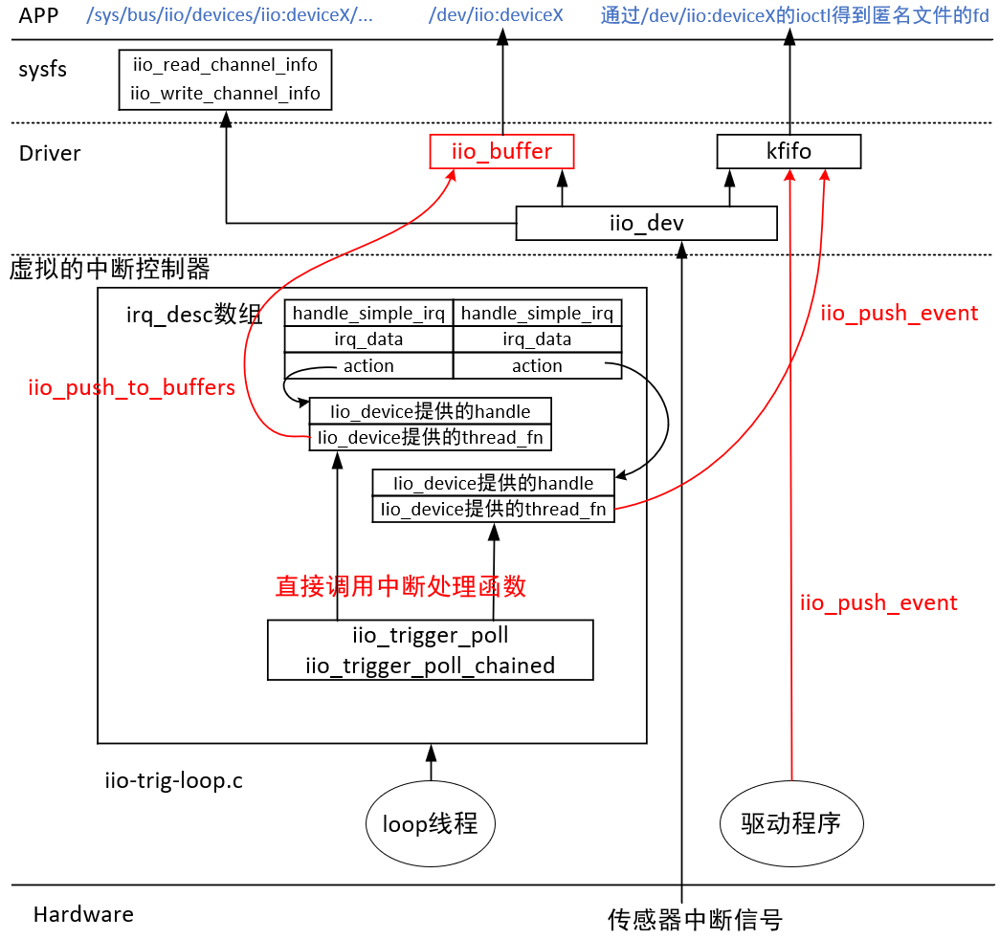

### 1.2 怎么表示事件

使用结构体"iio_event_data"表示事件：

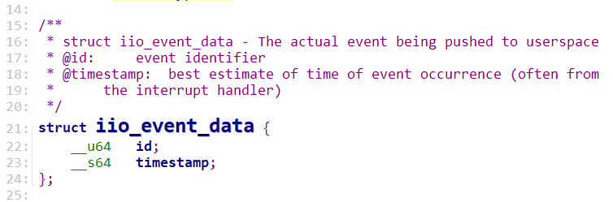


所谓事件就是一个64位的ID，里面不含有具体的数值：比如它表示温度超高了，但是没有表示温度值是多少。

这个ID如何表示不同的事件呢？如下：

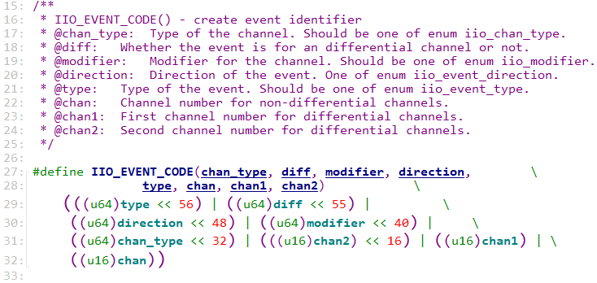


示例：

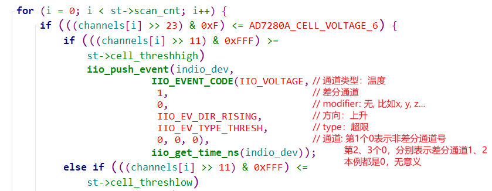


### 1.3 上机体验

IMX6ULL的源码：

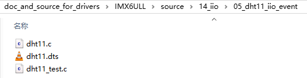

STM32MP157的源码：

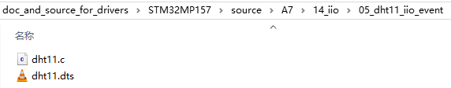

#### 1.3.1 IMX6ULL

```shell
insmod /root/iio-trig-hrtimer.ko
mkdir  /sys/kernel/config/iio/triggers/hrtimer/timer_abc  # 创建trigger
cat /sys/bus/iio/devices/trigger1/name             # 可以看到这个trigger

insmod /root/dht11.ko
cd /sys/bus/iio/devices/iio\:device2/
echo timer_abc > trigger/current_trigger               # 在设备上使用trigger

echo 1 > scan_elements/in_humidityrelative_en
echo 1 > scan_elements/in_temp_en
echo 1 > buffer/enable

# hexdump /dev/iio\:device2
/root/dht11_test /dev/iio\:device2  # 读取事件
```


#### 1.3.2 STM32MP157

```SHELL
# insmod /root/iio-trig-hrtimer.ko # 157上已经有了这个驱动
mkdir  /sys/kernel/config/iio/triggers/hrtimer/timer_abc  # 创建trigger
cat /sys/bus/iio/devices/trigger1/name             # 可以看到这个trigger

insmod /root/dht11.ko
cd /sys/bus/iio/devices/iio\:device1/
echo timer_abc > trigger/current_trigger               # 在设备上使用trigger

echo 1 > scan_elements/in_humidityrelative_en
echo 1 > scan_elements/in_temp_en
echo 1 > buffer/enable

# hexdump /dev/iio\:device1
/root/dht11_test /dev/iio\:device1  # 读取事件
```


## 2. iio_event数据流程

### 2.1 驱动程序创建KFIFO

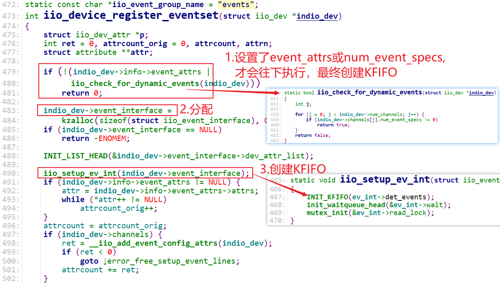


### 2.2 驱动程序写KFIFO

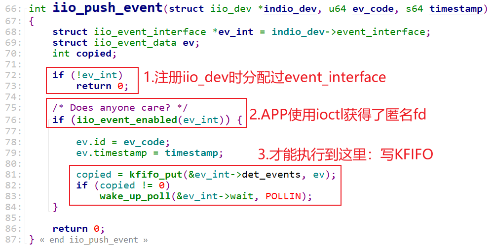


### 2.3 APP读取KFIFO

示例源码如下：

```c
int event_fd;
struct iio_event_data event;

int fd = open("/dev/iio:device2", O_RDWR);

ioctl(fd, IIO_GET_EVENT_FD_IOCTL, &event_fd);
read(event_fd, &event, sizeof(event));
```


## 3. 修改DHT11驱动使用iio_event

IMX6ULL的源码：

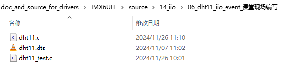

STM32MP157的源码：

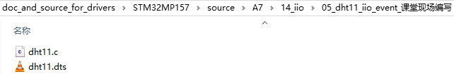

### 3.1 设备表明自己有event能力

在注册iio设备时，会进行如下判断：

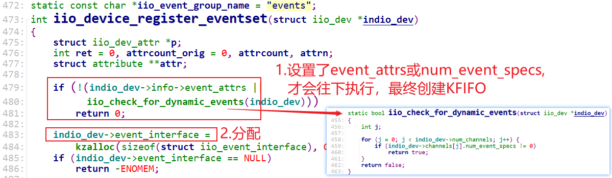

只有设置了indio_dev->info->event_attrs或某个通道的num_event_specs不为0，才会创建KFIFO。


示例代码如下：

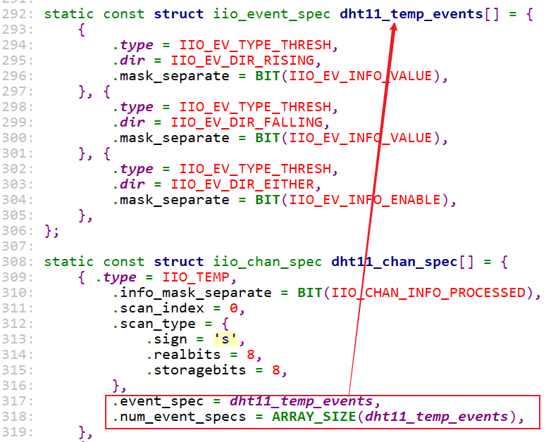


这会生成如下sysfs文件：

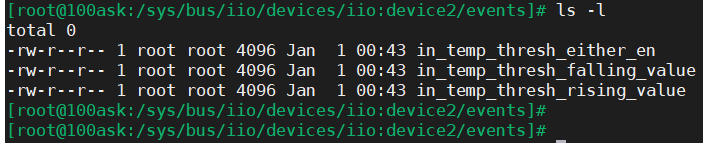


生成sysfs文件的流程为：

```c
iio_device_register
	iio_device_register_eventset
    	__iio_add_event_config_attrs
            for (j = 0; j < indio_dev->num_channels; j++) {
                ret = iio_device_add_event_sysfs(indio_dev,
                                 &indio_dev->channels[j]);
							iio_device_add_event                                	
```


这些sysfs对应的读写函数如下：

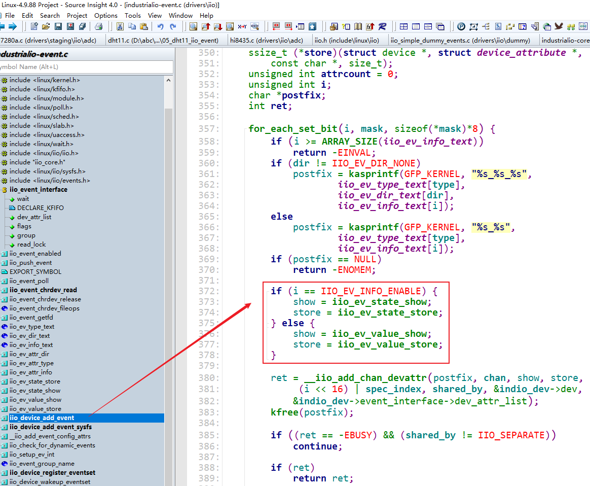


### 3.2 设备驱动提供sysfs接口函数

比如我们想指定温度的报警值，那么就需要实现这些sysfs的接口函数：


### 3.3 上机实验

#### 1.3.1 IMX6ULL

```shell
insmod /root/iio-trig-hrtimer.ko
mkdir  /sys/kernel/config/iio/triggers/hrtimer/timer_abc  # 创建trigger
cat /sys/bus/iio/devices/trigger1/name             # 可以看到这个trigger

insmod /root/dht11.ko
cd /sys/bus/iio/devices/iio\:device2/
echo timer_abc > trigger/current_trigger               # 在设备上使用trigger

echo 30 > events/in_temp_thresh_rising_value   # 设置上限报警值
echo 10 > events/in_temp_thresh_falling_value  # 设置下限报警值
echo 1 > events/in_temp_thresh_either_en       # 使能event

echo 1 > scan_elements/in_humidityrelative_en
echo 1 > scan_elements/in_temp_en
echo 1 > buffer/enable

# hexdump /dev/iio\:device2
/root/dht11_test /dev/iio\:device2  # 读取事件
```


#### 1.3.2 STM32MP157

```SHELL
# insmod /root/iio-trig-hrtimer.ko # 157上已经有了这个驱动
mkdir  /sys/kernel/config/iio/triggers/hrtimer/timer_abc  # 创建trigger
cat /sys/bus/iio/devices/trigger1/name             # 可以看到这个trigger

insmod /root/dht11.ko
cd /sys/bus/iio/devices/iio\:device1/
echo timer_abc > trigger/current_trigger               # 在设备上使用trigger

echo 30 > events/in_temp_thresh_rising_value   # 设置上限报警值
echo 10 > events/in_temp_thresh_falling_value  # 设置下限报警值
echo 1 > events/in_temp_thresh_either_en       # 使能event

echo 1 > scan_elements/in_humidityrelative_en
echo 1 > scan_elements/in_temp_en
echo 1 > buffer/enable

# hexdump /dev/iio\:device1
/root/dht11_test /dev/iio\:device1  # 读取事件
```


## 4. 使用trigger写iio_event(不实用)

IMX6ULL的源码：


STM32MP157的源码：


### 4.1 框图

下图中，左侧写kfifo的红色线条，就是使用trigger写iio_event：


### 4.2 提供虚拟中断处理函数

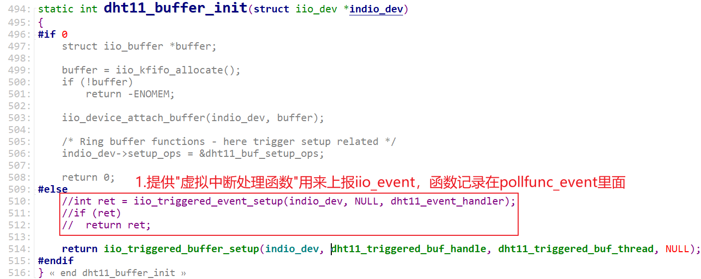


### 4.3 注册虚拟中断处理函数

设置iio_device的trgger，比如如下操作：

```shell
insmod /root/iio-trig-hrtimer.ko
mkdir  /sys/kernel/config/iio/triggers/hrtimer/timer_abc  # 创建trigger
cat /sys/bus/iio/devices/trigger1/name             # 可以看到这个trigger

insmod /root/dht11.ko
cd /sys/bus/iio/devices/iio\:device2/
echo timer_abc > trigger/current_trigger               # 在设备上使用trigger
```

会导致如下函数被调用，它就注册了"记录在pollfunc_event里的"虚拟中断函数：

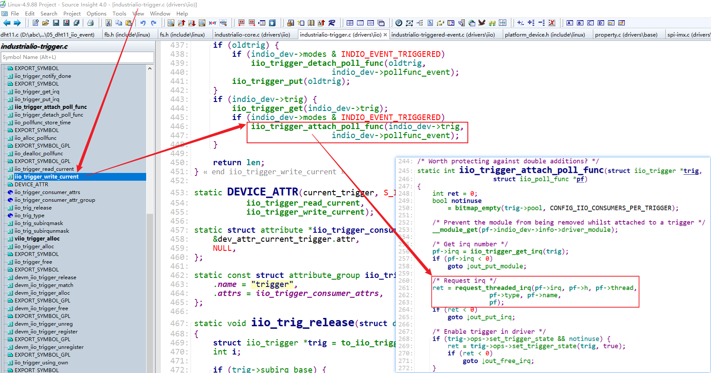


注意，对比一下：

* "记录在pollfunc_event里的"虚拟中断函数：
  * 在设置iio设备的current_trigger时就注册了中断, 就会使能trigger state
  * 用来产生iio_event，写KFIFO
* "记录在pollfunc里的"虚拟中断函数：
  * 在设置iio设备的current_trigger后、并且使能了buffer，才注册中断, 就会使能trigger state
  * 用来读取传感器数据，写iio_buffer

### 4.4 上机体验

#### 4.4.1 修改内核支持

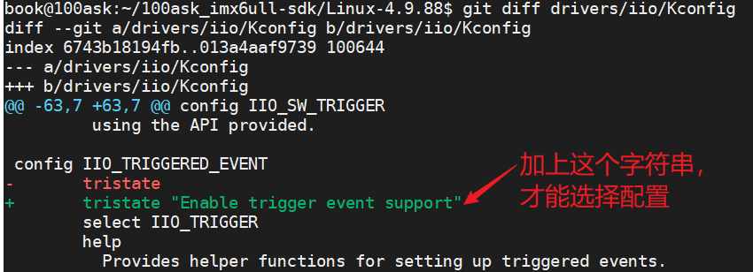


#### 4.4.2 具体操作

IMX6ULL:

```shell
insmod /root/iio-trig-hrtimer.ko
mkdir  /sys/kernel/config/iio/triggers/hrtimer/timer_abc  # 创建trigger
cat /sys/bus/iio/devices/trigger1/name             # 可以看到这个trigger

insmod /root/industrialio-triggered-event.ko

insmod /root/dht11.ko
cd /sys/bus/iio/devices/iio\:device2/
echo timer_abc > trigger/current_trigger               # 在设备上使用trigger

echo 30 > events/in_temp_thresh_rising_value   # 设置上限报警值
echo 10 > events/in_temp_thresh_falling_value  # 设置下限报警值
echo 1 > events/in_temp_thresh_either_en       # 使能event

echo 1 > scan_elements/in_humidityrelative_en
echo 1 > scan_elements/in_temp_en
echo 1 > buffer/enable

# hexdump /dev/iio\:device2
/root/dht11_test /dev/iio\:device2  # 读取事件
```


STM32MP157:

```shell
# insmod /root/iio-trig-hrtimer.ko # 157上已经有了这个驱动
mkdir  /sys/kernel/config/iio/triggers/hrtimer/timer_abc  # 创建trigger
cat /sys/bus/iio/devices/trigger1/name             # 可以看到这个trigger

insmod /root/industrialio-triggered-event.ko

insmod /root/dht11.ko
cd /sys/bus/iio/devices/iio\:device1/
echo timer_abc > trigger/current_trigger               # 在设备上使用trigger

echo 30 > events/in_temp_thresh_rising_value   # 设置上限报警值
echo 10 > events/in_temp_thresh_falling_value  # 设置下限报警值
echo 1 > events/in_temp_thresh_either_en       # 使能event

echo 1 > scan_elements/in_humidityrelative_en
echo 1 > scan_elements/in_temp_en
echo 1 > buffer/enable

# hexdump /dev/iio\:device1
/root/dht11_test /dev/iio\:device1  # 读取事件
```

