# iio驱动示例

IIO(Industrial I/O)参考资料：

* 系列文章：https://blog.csdn.net/lickylin/article/details/108177756
* https://www.cnblogs.com/yongleili717/p/10758691.html
* 内核文档：https://www.kernel.org/doc/html/v5.3/driver-api/iio
* 参考内核源码
  * IMX6ULL: `drivers\iio\adc\vf610_adc.c`
  * STM32MP157: `drivers\iio\adc\stm32-adc-core.c`，`drivers\iio\adc\stm32-adc.c`


## 1. IMX6ULL ADC驱动

### 1.1 设备树

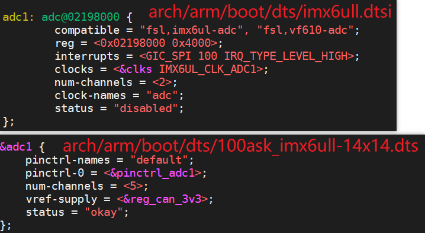


### 1.2 驱动程序

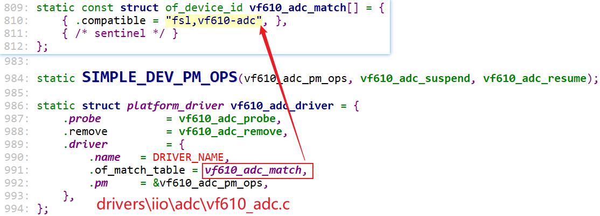


### 1.3 驱动程序分析

```shell
static int vf610_read_raw(struct iio_dev *indio_dev,
			struct iio_chan_spec const *chan,
			int *val,
			int *val2,
			long mask)

怎么使用val, val2 ?

IIO_VAL_INT : 只有整数没有小数, 整数保存在val里，val2不使用。
IIO_VAL_INT_PLUS_MICRO : val=整数，val2=小数部分*1000000，比如3.14如此保存：*val = 3; *val2 = 140000
IIO_VAL_INT_PLUS_NANO  : val=整数，val2=小数部分*1000000000，比如3.14如此保存：*val = 3; *val2 = 140000000
IIO_VAL_INT_PLUS_MICRO_DB : DB数据，数值的表示方法跟IIO_VAL_INT_PLUS_MICRO一样，添加了单位DB。
IIO_VAL_INT_MULTIPLE : 返回多个整数值，主要用于iio_info的read_raw_multi函数。
IIO_VAL_FRACTIONAL   : 分数，比如n/m，表示为：*val=n, *val2=m
IIO_VAL_FRACTIONAL_LOG2 : LOG2值, 比如*val=1，*val2=4，表示的数值为：val>>val2, 即1>>4=0.03125
```


### 1.4 驱动程序使用

#### 1.4.1 各类值的含义

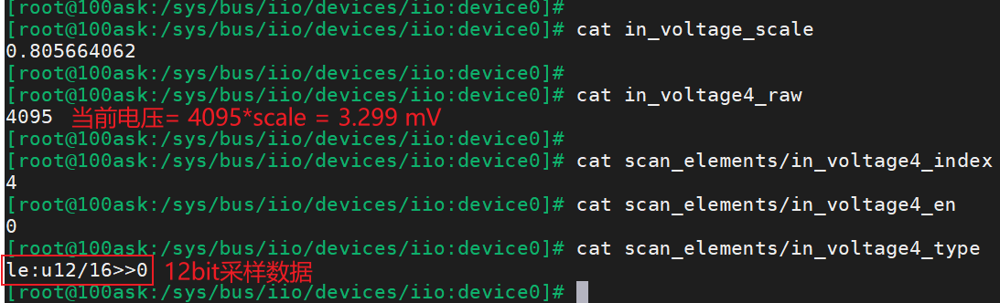

#### 1.4.2 示例

IMX6ULL原理图：

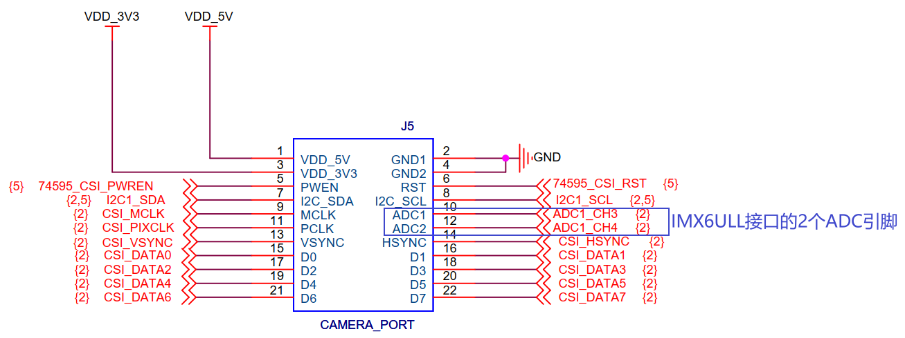

可以通过扩展板引出，原理图如下：

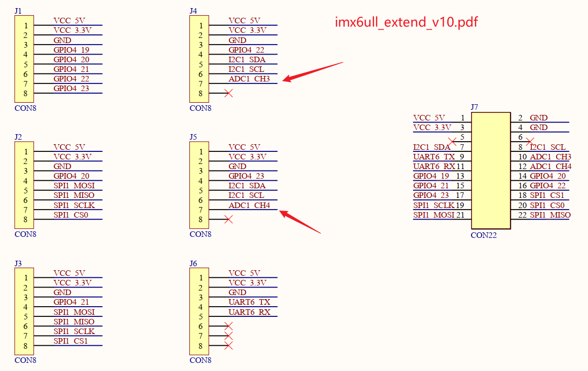


测试时接线方法：可以把ADC1_CH3或ADC1_CH4，接到3V3或GND，如下图：

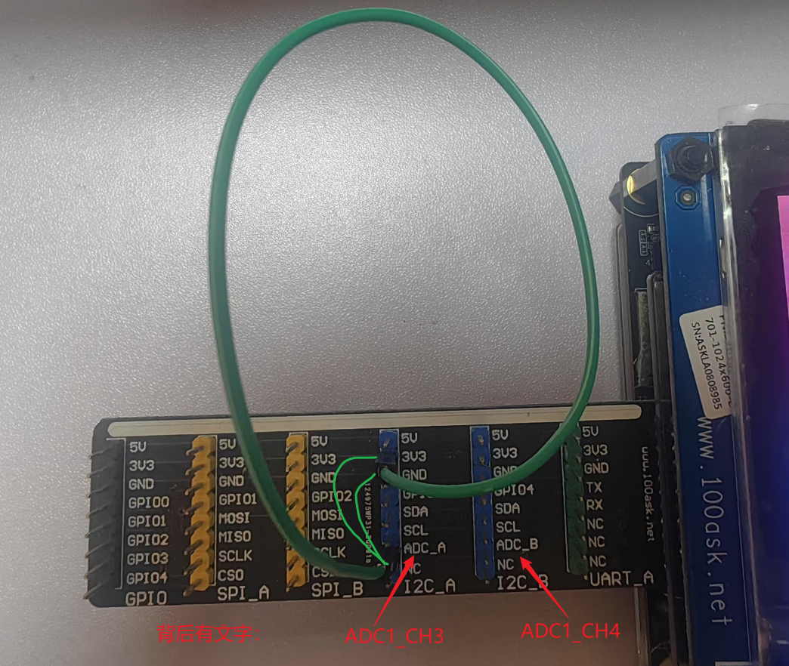


操作命令：

```shell
# 单步操作
cd /sys/bus/iio/devices/iio:device0  
cat in_voltage3_raw

# 使用buffer
insmod /root/iio-trig-hrtimer.ko
mkdir  /sys/kernel/config/iio/triggers/hrtimer/timer_abc  # 创建trigger
cat /sys/bus/iio/devices/trigger1/name             # 可以看到这个trigger
# 设置trigger周期
cd /sys/bus/iio/devices/trigger1
echo 1000000000 > sampling_frequency  # 单位ns, 1s一次

cd /sys/bus/iio/devices/iio\:device0/
echo timer_abc > trigger/current_trigger               # 在设备上使用trigger

echo 1 > scan_elements/in_voltage3_en
echo 1024 > buffer/length
echo 1 > buffer/enable

# hexdump /dev/iio\:device1
hexdump /dev/iio\:device0  # 读取数据
```


注意：使用buffer功能会死机，原因未明。


## 2. STM32MP157 ADC驱动

### 2.1 设备树与驱动

如何确定设备树与驱动？百问网STM32MP157开发板使用的设备树文件是`stm32mp157c-100ask-512d-lcd-v1.dtb`，可以在Ubuntu使用如下命令反汇编得到dts文件：

```shell
dtc -I dtb -O dts stm32mp157c-100ask-512d-lcd-v1.dtb > 1.dts
```

在1.dts中搜`adc`，可以看到如下节点，根据里面的`compatible`属性即可找到设备树和驱动：

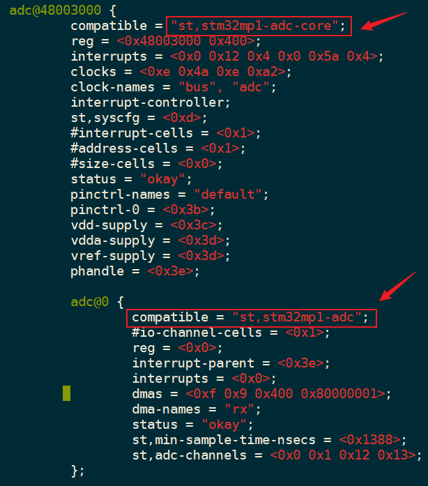


#### 2.1.1 设备树文件

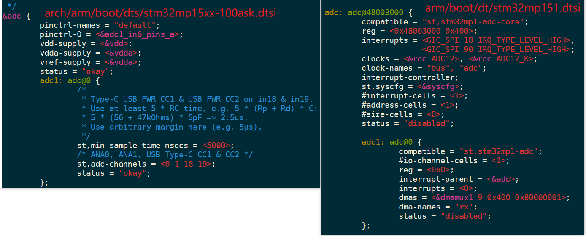

#### 2.1.2 驱动文件

`drivers\iio\adc\stm32-adc-core.c`，`drivers\iio\adc\stm32-adc.c`


### 2.2 为何驱动程序无法使用

#### 2.2.1 pinmux空缺

查看内核打印信息：

```shell
[    4.112842] stm32mp157-pinctrl soc:pin-controller@50002000: missing pins property in node pins .
[    4.120360] stm32-adc-core: probe of 48003000.adc failed with error -22

```

根据错误信息"missing pins property in node"，找到驱动：pinctrl/stm32/pinctrl-stm32.c

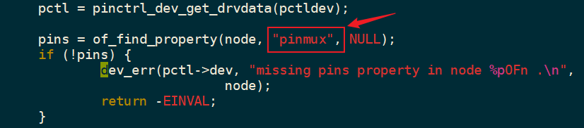

在设备树里确实发现ADC使用的pinctrl里没有"pinmux"属性：

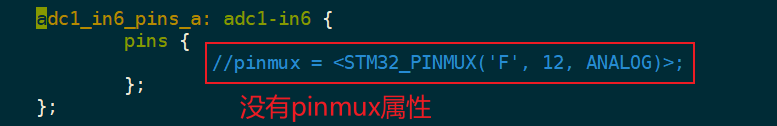


如此修改：

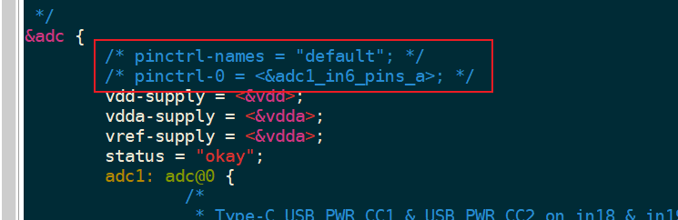


#### 2.2.2 提供regulator

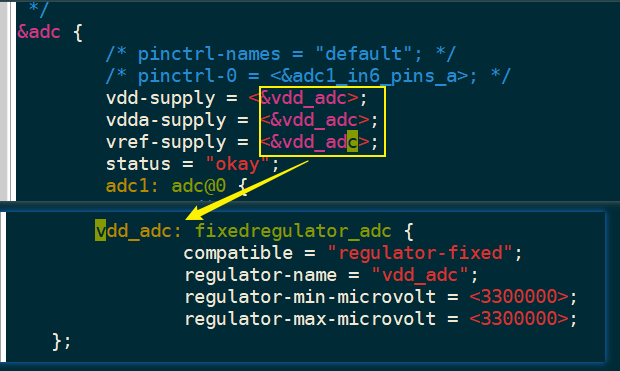


### 2.3 上机实验

#### 2.3.1 原理图与接线

STM32MP157原理图：

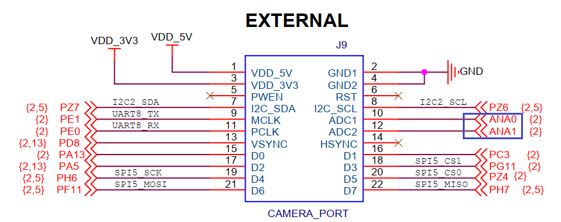

扩展板原理图：

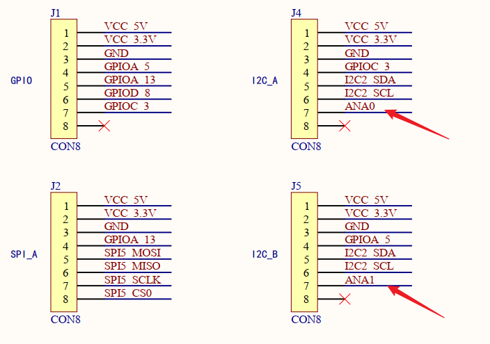


接线方法：

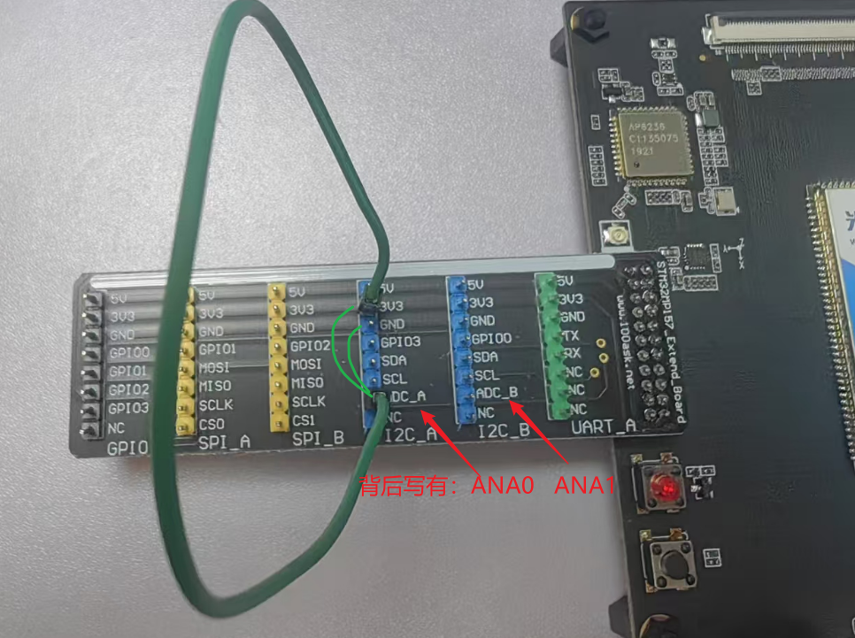


#### 2.3.2 测试命令

```shell
# 单步操作
cd /sys/bus/iio/devices/iio:device1  
cat in_voltage0_raw

# 使用buffer
# insmod /root/iio-trig-hrtimer.ko  # STM32MMP157无需安装驱动
mkdir  /sys/kernel/config/iio/triggers/hrtimer/timer_abc  # 创建trigger
cat /sys/bus/iio/devices/trigger1/name             # 可以看到这个trigger
# 设置trigger周期
cd /sys/bus/iio/devices/trigger1
echo 1000000000 > sampling_frequency  # 单位ns, 1s一次

cd /sys/bus/iio/devices/iio\:device1/
echo timer_abc > trigger/current_trigger               # 在设备上使用trigger

echo 1 > scan_elements/in_voltage0_en
echo 1024 > buffer/length
echo 1 > buffer/enable

# hexdump /dev/iio\:device1
hexdump /dev/iio\:device1  # 读取数据
```


### 2.4 驱动程序分析

