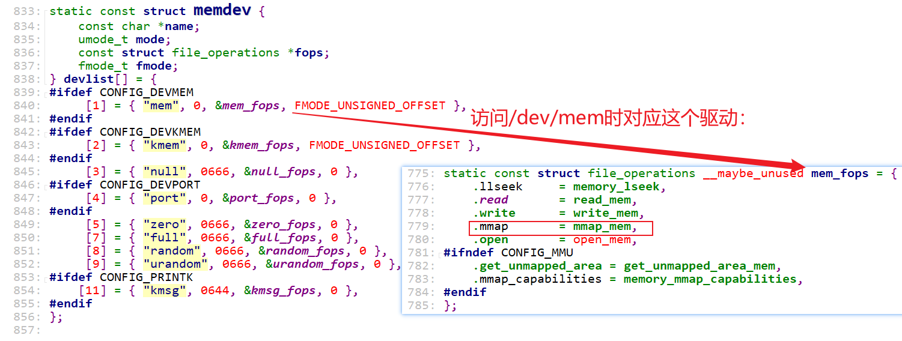

# devmem应用与驱动分析

APP devmem2的GIT仓库：

```shell
https://github.com/VCTLabs/devmem2
```


`devmem` 和 `devmem2` 是 Linux 系统中两个用于直接读写物理内存地址的用户空间工具，它们通过访问 `/dev/mem` 设备实现底层硬件操作。尽管功能相似，但在设计目标、功能支持和兼容性等方面存在显著差异。以下是两者的详细对比：

---

### **1. 功能与设计目标**
| 特性         | devmem                            | devmem2                              |
| ------------ | --------------------------------- | ------------------------------------ |
| **位宽支持** | 仅支持 **32位（4字节）** 读写操作 | 支持 **8位、16位、32位** 读写操作    |
| **地址范围** | 通常受限于 **32位地址空间**       | 支持 **64位地址空间**（需内核支持）  |
| **灵活性**   | 功能单一，仅基本读写              | 提供更灵活的位宽选择和参数控制       |
| **设计初衷** | 简单调试工具，集成于部分发行版    | 增强版工具，弥补 `devmem` 的功能限制 |

---

### **2. 使用语法**
#### **devmem**
```bash
devmem <物理地址> [值]
```
- **示例**：
  ```bash
  devmem 0xFE200000        # 读取地址 0xFE200000 的 32 位值
  devmem 0xFE200000 0x1234 # 向地址 0xFE200000 写入 32 位值 0x1234
  ```
- **限制**：
  - 只能操作 32 位数据，无法指定其他位宽。
  - 地址需为 4 字节对齐（否则可能报错或截断）。

#### **devmem2**
```bash
devmem2 <物理地址> [模式] [值]
```
- **模式参数**：
  
  - `b`：8 位（字节）操作
  - `w`：16 位（字）操作
  - `l`：32 位（长字）操作（默认）
- **示例**：
  ```bash
  devmem2 0xFE200000           # 读取 32 位值（默认模式）
  devmem2 0xFE200000 w 0x1234  # 向地址写入 16 位值 0x1234
  devmem2 0xFE200000 b         # 读取 8 位值
  ```
- **优势**：
  
  - 支持非对齐地址（自动处理对齐问题）。
  - 显式指定位宽，避免误操作。

---

### **3. 兼容性与依赖**
| 特性             | devmem                                         | devmem2                            |
| ---------------- | ---------------------------------------------- | ---------------------------------- |
| **内核依赖**     | 依赖 `/dev/mem` 设备（需启用 `CONFIG_DEVMEM`） | 同左                               |
| **发行版集成**   | 集成于部分系统（如 Busybox）                   | 通常需手动编译安装                 |
| **64位系统支持** | 可能无法访问高位物理地址                       | 支持 64 位地址（需内核和硬件支持） |

---

### **4. 安全性**
- **共同点**：
  - 均需 **root 权限** 运行（因直接访问 `/dev/mem`）。
  - 可能触发安全机制（如启用 `CONFIG_STRICT_DEVMEM` 时限制访问范围）。
- **风险**：
  - 错误操作可能损坏硬件或导致系统崩溃。
  - `devmem2` 由于支持更灵活的位宽，误操作风险更高（如错误修改单字节导致寄存器状态异常）。

---

### **5. 典型使用场景**
| 场景                     | devmem               | devmem2                              |
| ------------------------ | -------------------- | ------------------------------------ |
| **快速读写32位寄存器**   | 适用（简单场景）     | 适用，但更推荐 `devmem2`             |
| **操作8/16位硬件寄存器** | 不支持               | 主要优势场景                         |
| **访问高位物理地址**     | 受限（32位地址空间） | 适用（如 PCIe BAR 空间、大内存设备） |

---

### **6. 示例对比**
#### **读取 16 位寄存器的值**
- **devmem**：无法直接实现，需读取 32 位后手动截断。
  ```bash
  devmem 0xFE200000  # 返回 0xAABBCCDD，需手动提取目标 16 位值
  ```
- **devmem2**：直接指定模式 `w`：
  ```bash
  devmem2 0xFE200000 w  # 直接返回 0xCCDD（16位值）
  ```

#### **写入 8 位值**
- **devmem**：无法实现（强制写入 32 位，可能覆盖相邻寄存器）。
- **devmem2**：
  ```bash
  devmem2 0xFE200000 b 0x12  # 仅修改目标地址的 8 位数据
  ```


### 7. 驱动分析

驱动源码：`drivers/char/mem.c`




### **8. 使用devmem操作LED**

#### 8.1 IMX6ULL

```shell
devmem2 0x02290014 w 5           # enable gpio5
devmem2 0x020AC004 w 0xFEC       # 配置gpio5_io3 as output 
devmem2 0x020AC000 w 0x6E6       # gpio5_io3输出0点亮LED
devmem2 0x020AC000 w 0x6Ee       # gpio5_io3输出1熄灭LED
```


#### 8.2 STM32MP157

STM32MP157上使用如下命令无法控制LED，原因待查。

```shell
echo none > /sys/class/leds/heartbeat/trigger  # 先关闭系统自带的驱动
devmem2 0x50000894 w 0x00000023  # enable PLL4
devmem2 0x50000A28 w 1           # enable GPIOA
devmem2 0x50002000 w 0x100000    # set gpioa10 as output
devmem2 0x50002018 w 0x4000000   # set gpioa10 output 0
devmem2 0x50002018 w 0x400       # set gpioa10 output 1
```


### **总结**

| **对比项**   | **devmem**             | **devmem2**                  |
| ------------ | ---------------------- | ---------------------------- |
| **功能**     | 单一（仅32位读写）     | 灵活（8/16/32位读写）        |
| **地址支持** | 32位地址               | 64位地址                     |
| **易用性**   | 简单，但限制多         | 复杂但功能全面               |
| **适用场景** | 快速调试32位对齐寄存器 | 精细操作硬件寄存器或高位地址 |
| **推荐程度** | 逐渐被替代             | 更推荐用于复杂场景           |

---

### **选择建议**
- **优先使用 `devmem2`**：  
  需要操作非 32 位寄存器、非对齐地址或 64 位物理地址时（如嵌入式开发、PCIe 设备调试）。
- **仅使用 `devmem`**：  
  临时调试 32 位对齐寄存器，且系统已集成该工具（如 Busybox 环境）。

---

### **注意事项**
1. **谨慎操作**：直接读写物理内存可能破坏系统稳定性。
2. **权限控制**：仅在必要时使用 root 权限，避免滥用。
3. **内核配置**：确保 `CONFIG_STRICT_DEVMEM` 未过度限制目标地址范围。