## UIO驱动程序分析与编写

源码:

```shell
drivers\uio\uio.c
drivers\target\target_core_user.c
```


### 1. UIO驱动程序分析

源码：`drivers\uio\uio.c`

#### 1.1 层次

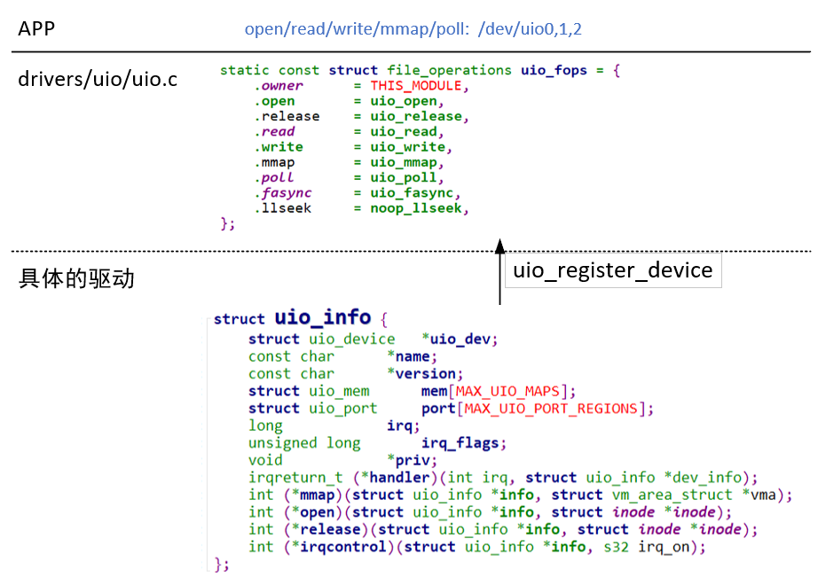


#### 1.2 情景分析：注册

* 第1层：源码`drivers\uio\uio.c`
  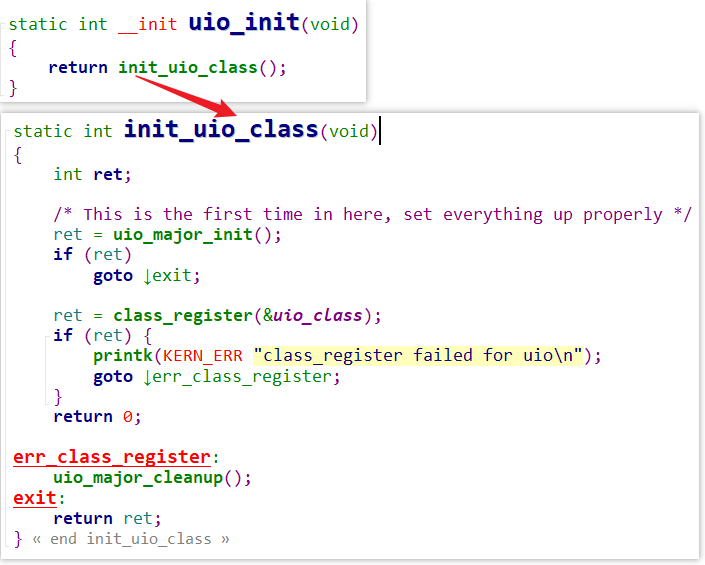
* 第2层：参考`drivers\target\target_core_user.c`

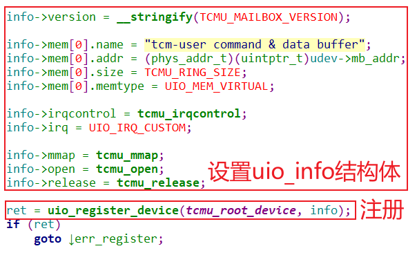

* uio_register_device内部细节：生产uio_device结构体，注册设备、注册中断
  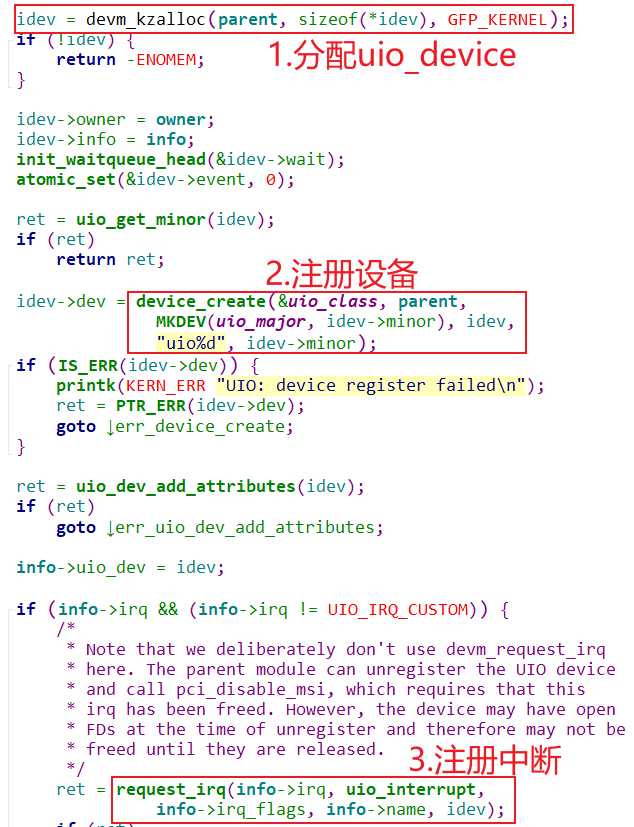

#### 1.3 情景分析：mmap

* 驱动里设置uio_info时，提供了物理地址或内核内部使用的虚拟地址

  uio_info的mem数组里可以记录多段地址空间，这些地址空间有3类（使用memtype来标记）
  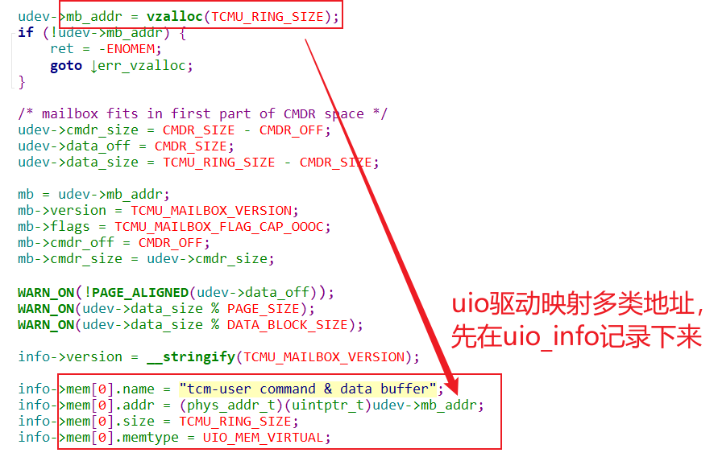

  memtype有如下取值：

  | 特性             | `UIO_MEM_PHYS`                   | `UIO_MEM_LOGICAL`            | `UIO_MEM_VIRTUAL`              |
  | :--------------- | :------------------------------- | :--------------------------- | :----------------------------- |
  | **地址类型**     | 直接物理地址                     | 内核逻辑地址（物理连续）     | 内核虚拟地址（物理可能不连续） |
  | **物理连续性**   | 是                               | 是                           | 否                             |
  | **分配函数**     | `request_mem_region` + `ioremap` | `kmalloc` / `ioremap`        | `vmalloc`                      |
  | **用户空间映射** | 直接映射物理地址                 | 通过逻辑地址间接映射物理地址 | 逐页映射虚拟地址对应的物理页   |
  | **典型用途**     | 硬件寄存器、固定物理内存         | DMA缓冲区、物理连续内核内存  | 大块非连续内存（如软件缓冲区） |

* APP调用mmap得到用户使用的虚拟地址
  假设uio_info里定义了多段内存，APP使用mmap时如何制定要映射哪段内存？这是通过在调用mmap时传入的offset来指定的：

  * offset= 0*4096，表示使用uio_info->mem[0]这段内存
  * offset= 1*4096，表示使用uio_info->mem[1]这段内存
  * 以此类推


#### 1.4 情景分析：read

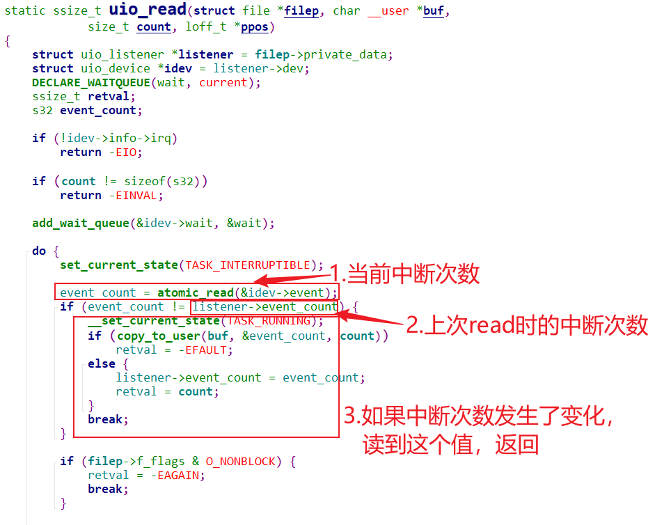


#### 1.5 情景分析：谁修改中断次数？

中断函数：
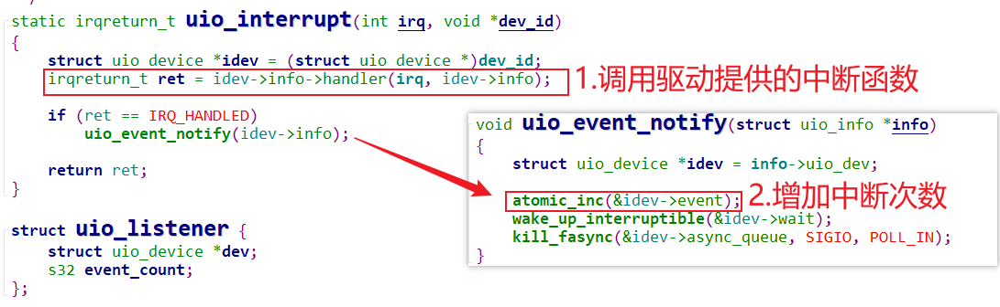

#### 1.6 情景分析：write

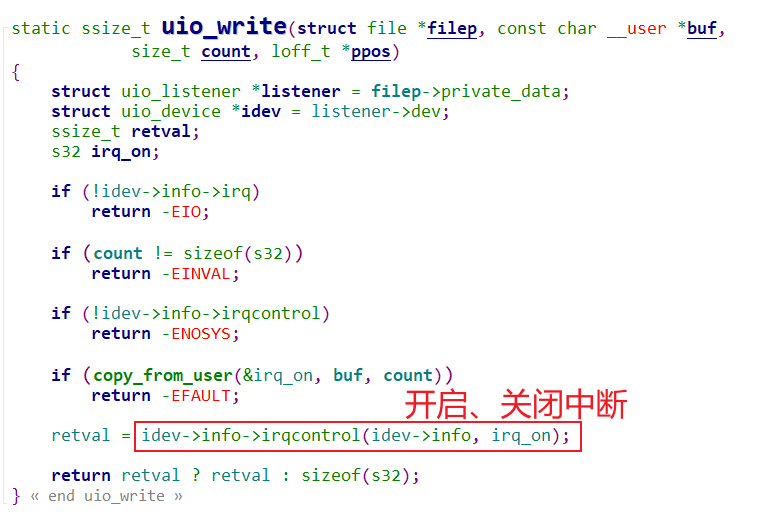


### 2. UIO驱动编写与测试

#### 2.1 IMX6ULL

源码：

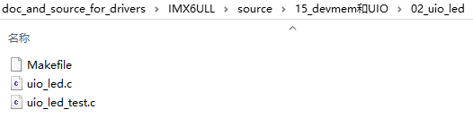

以前使用以下命令操作过LED：

```shell
devmem2 0x02290014 w 5           # enable gpio5
devmem2 0x020AC004 w 0xFEC       # 配置gpio5_io3 as output 
devmem2 0x020AC000 w 0x6E6       # gpio5_io3输出0点亮LED
devmem2 0x020AC000 w 0x6Ee       # gpio5_io3输出1熄灭LED
```

现在编写UIO驱动程序，把这2段物理地址暴露给用户空间（都是4096字节对齐）：

* 0x02290000
* 0x020AC000


##### 2.1.1 编译

先配置内核支持UIO：

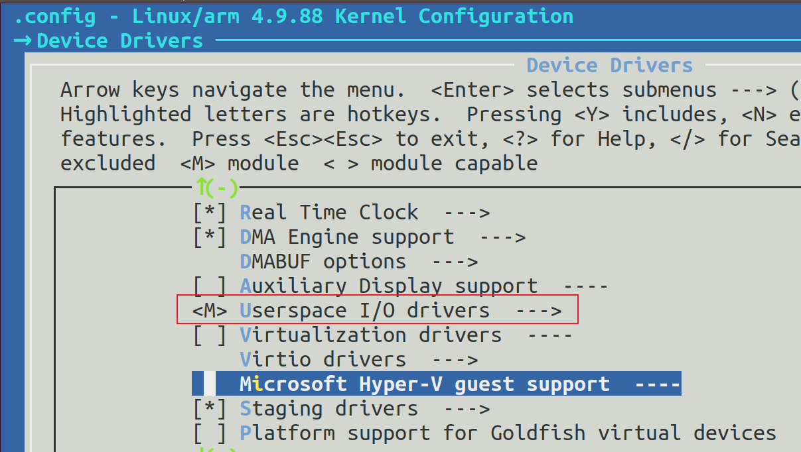

然后执行如下命令得到drivers/uio/uio.ko：

```shell
make  modules
```


接着编译驱动：在02_uio_led目录下执行make命令即可。


##### 2.1.2 上机实验

执行如下命令：

```shell
# insmod uio.ko
# insmod uio_led.ko
# ls /dev/uio*
# ./uio_led_test /dev/uio0 on
# ./uio_led_test /dev/uio0 off
```


#### 2.2 STM32MP157

```shell
devmem2 0x50000894 w 0x00000023  # enable PLL4
devmem2 0x50000A28 w 1           # enable GPIOA
devmem2 0x50002000 w 0x100000    # set gpioa10 as output
devmem2 0x50002018 w 0x4000000   # set gpioa10 output 0
devmem2 0x50002018 w 0x400       # set gpioa10 output 1
```


现在编写UIO驱动程序，把这2段物理地址暴露给用户空间（都是4096字节对齐）：

* 0x50000000
* 0x50002000

##### 2.2.1 编译

先配置内核支持UIO：

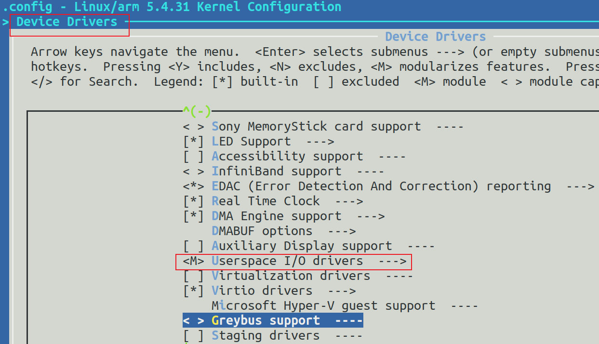

然后执行如下命令得到drivers/uio/uio.ko：

```shell
make  modules
```


接着编译驱动：在02_uio_led目录下执行make命令即可。


##### 2.2.2 上机实验

执行如下命令：

```shell
# insmod uio.ko
# insmod uio_led.ko
# ls /dev/uio*
# ./uio_led_test /dev/uio0 on
# ./uio_led_test /dev/uio0 off
```

