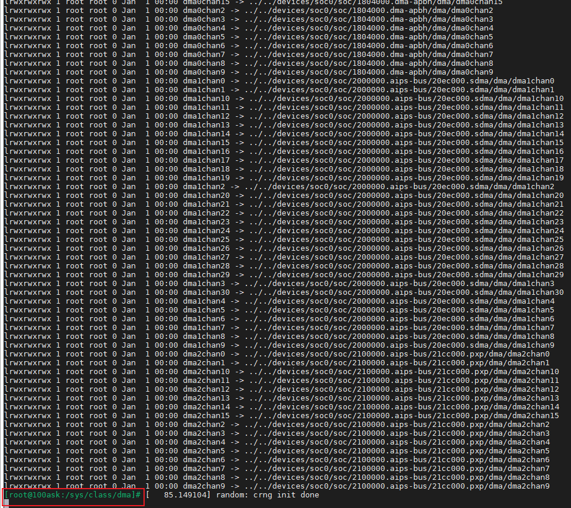
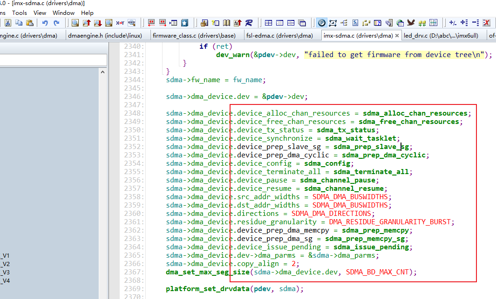
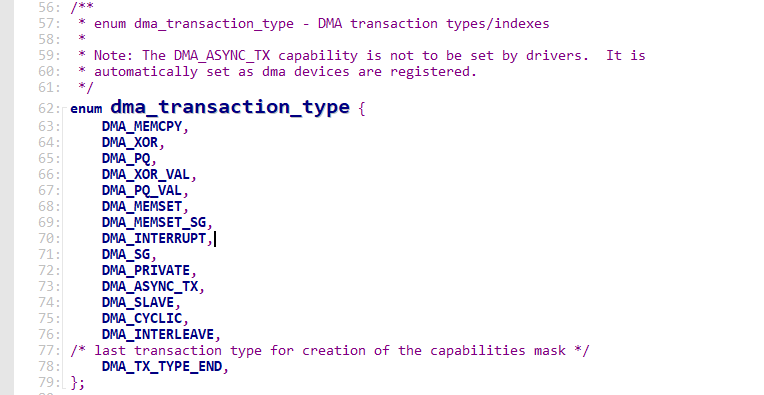

# dma学习笔记

## 1. 参考资料

Linux dma的使用与理解 https://blog.csdn.net/tang_vincent/article/details/146529018


## 2. 源码解读

设备树

```shell
                        sdma@020ec000 {
                                compatible = "fsl,imx6ul-sdma", "fsl,imx35-sdma";
                                reg = <0x20ec000 0x4000>;
                                interrupts = <0x0 0x2 0x4>;
                                clocks = <0x1 0xb8 0x1 0xb8>;
                                clock-names = "ipg", "ahb";
                                #dma-cells = <0x3>;
                                iram = <0x5>;
                                fsl,sdma-ram-script-name = "imx/sdma/sdma-imx6q.bin";
                                linux,phandle = <0x7>;
                                phandle = <0x7>;
                        };

```




源码：dma/imx-sdma.c


## 3. 概念

scatterlist



